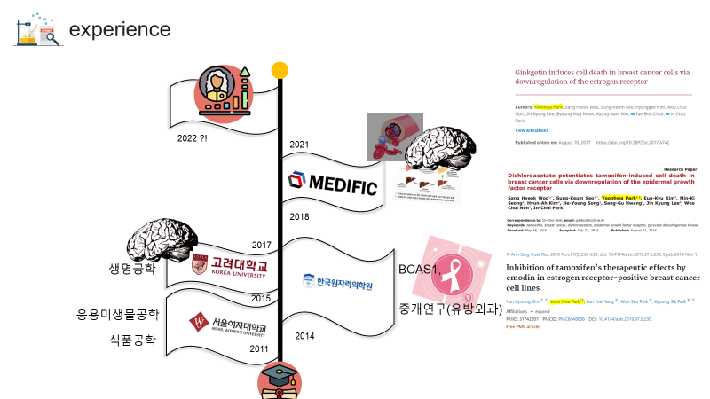
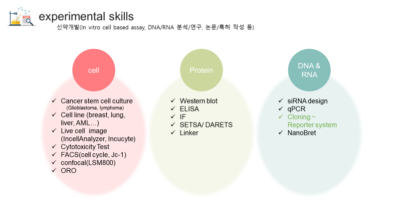
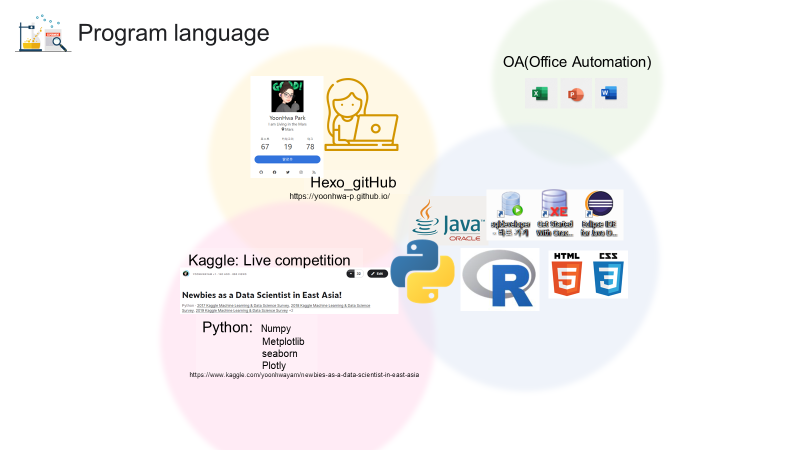
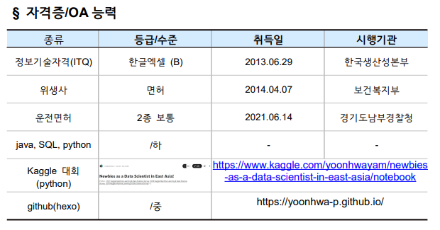
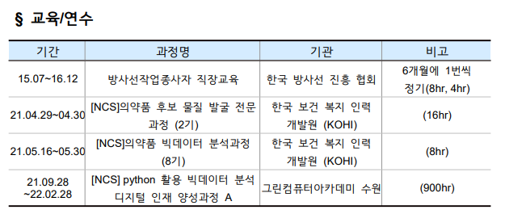
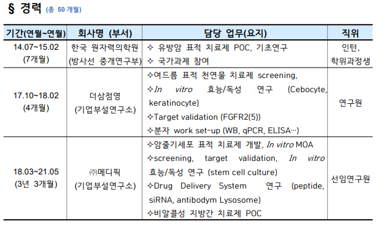

# MyBlog
--- 

- Name : YoonHwa Park 
- birth : 91.03.04
- e-mail : brilliant_bio@naver.com

---

- paper
  1. Ginkgetin induces cell death in breast cancer cells via downregulation of the estrogen receptor (1저자)
    [ONCOLOGY LETTERS 14: 5027-5033](https://pubmed.ncbi.nlm.nih.gov/29085516/)
  2. Dichloroacetate potentiates tamoxifen-induced cell death in breast cancer cells via downregulation of the epidermal growth factor receptor  (3저자)
    [Oncotarget, Vol. 7, No. 37.](https://pubmed.ncbi.nlm.nih.gov/27494858/)
  3. Inhibition of tamoxifen's therapeutic effects by emodin in estrogen receptor-positive breast cancer cell lines (1저자)
    [AnnSurg Treat Res 2019;97(5):230-238.](https://pubmed.ncbi.nlm.nih.gov/31742207/)

  

  

- [Kaggle competition](https://www.kaggle.com/yoonhwayam/newbies-as-a-data-scientist-in-east-asia/notebook)

  

 

 

 