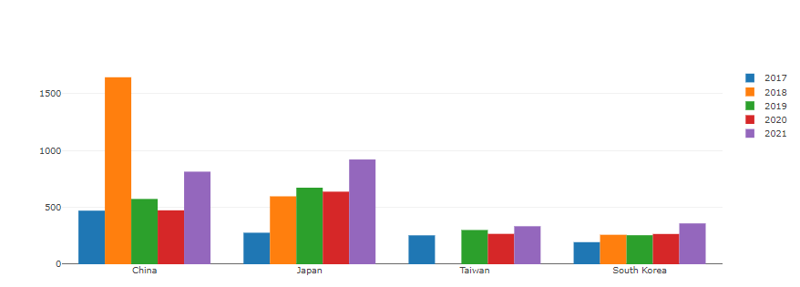

# World Vs East Asia

<br><br>
<hr>


##python을 이용한 plotly Library로 plot 그리기

[subplots](https://plotly.com/python/subplots/) 를 이용하여 다중 그래프를 그려 보자.


### python Library Import

```python
import numpy as np
import pandas as pd
import seaborn as sns
import matplotlib.pylab as plt

import plotly.io as pio
import plotly.express as px
import plotly.graph_objects as go
import plotly.figure_factory as ff
from plotly.subplots import make_subplots
from plotly.offline import init_notebook_mode, iplot
init_notebook_mode(connected=True)
pio.templates.default = "none"
# import plotly.offline as py
# py.offline.init_notebook_mode()

import os
for dirname, _, filenames in os.walk('/kaggle/input'):
    for filename in filenames:
        print(os.path.join(dirname, filename))

import warnings
warnings.filterwarnings("ignore")
```
### data import

```python
df17= pd.read_csv("/kaggle/input/kaggle-survey-2017/multipleChoiceResponses.csv", encoding="ISO-8859-1")
df18= pd.read_csv("/kaggle/input/kaggle-survey-2018/multipleChoiceResponses.csv", )
df19= pd.read_csv("/kaggle/input/kaggle-survey-2019/multiple_choice_responses.csv", )
df20= pd.read_csv("/kaggle/input/kaggle-survey-2020/kaggle_survey_2020_responses.csv", )
df21= pd.read_csv("/kaggle/input/kaggle-survey-2021/kaggle_survey_2021_responses.csv", )

```
### data frame 전처리


i) Q3를 기준으로 EastAsia에 속하는 나라만 연도별로 뽑아냅니다.  

```python
df21_Ea=df21[df21['Q3'].isin(EastAsia21)]
Ea21= (
    df21_Ea['Q3'].value_counts().to_frame()
    .reset_index().rename(columns={'index':'Country', 'Q3':'21'}))


df20_Ea=df20[df20['Q3'].isin(EastAsia)]
Ea20= (
    df20_Ea['Q3'].replace('Republic of Korea','South Korea')
    .value_counts().to_frame().reset_index()
    .rename(columns={'index':'Country', 'Q3':'20'}))


df19_Ea=df19[df19['Q3'].isin(EastAsia)]
Ea19= (df19_Ea['Q3'].replace('Republic of Korea','South Korea')
       .value_counts().to_frame().reset_index()
       .rename(columns={'index':'Country', 'Q3':'19'}))


df18_Ea=df18[df18['Q3'].isin(EastAsia)]
Ea18= (df18_Ea['Q3'].replace('Republic of Korea','South Korea')
       .value_counts().to_frame().reset_index()
       .rename(columns={'index':'Country', 'Q3':'18'}))
Ea18.value_counts()
#df18 열에 taiwan = 0을 추가 해야 합니다. 


df17_Ea = df17[df17['Country'].isin(EastAsia)]
Ea17= (df17_Ea['Country'].replace("People 's Republic of China",'China')
       .value_counts().to_frame().reset_index()
       .rename(columns={'index':'Country', 'Country':'17'}))

```

ii) data를 합쳐서 하나의 dataframe으로 만들음.

이 과정에서 pd.merge()를 사용 해 주었기 때문에 18' taiwan data가 Nan으로 추가 되었다. 


```python
fig = go.Figure(data=[
    go.Bar(name='2017', x=df5years['Country'], y=df5years['17']),
    go.Bar(name='2018', x=df5years['Country'], y=df5years['18']),
    go.Bar(name='2019', x=df5years['Country'], y=df5years['19']),
    go.Bar(name='2020', x=df5years['Country'], y=df5years['20']),
    go.Bar(name='2021', x=df5years['Country'], y=df5years['21'])
])

fig.show()
```





* dictation 할 때 까지만 해도 bar 그래프 그리는 것이 뭐그리 어렵겠나? 했다.
* 그냥 복사 붙여넣기로 만드려고 했는데
* 그게 참 안되네 ㅂㄷㅂㄷ 
