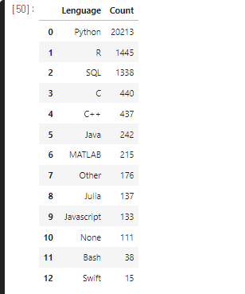
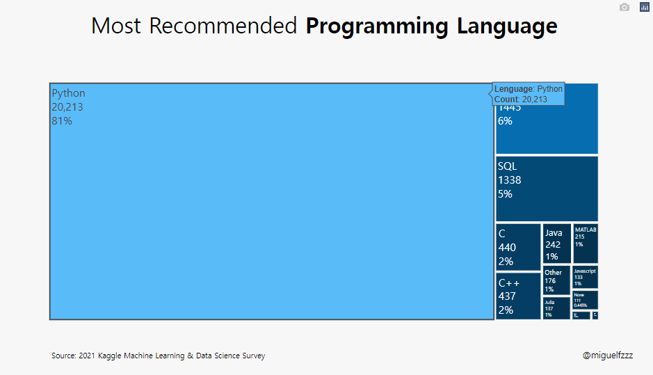
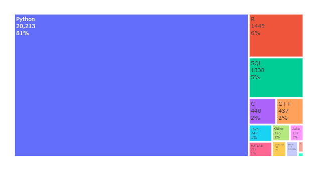
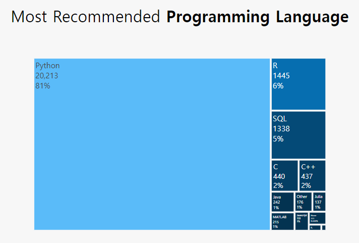
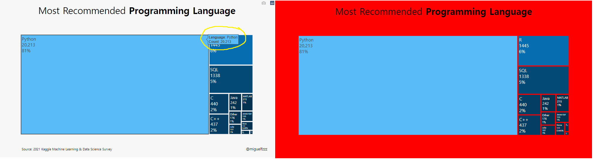

# kaggle dictation

<br><br>

### plotly.graph_objects as go : 를 이용한 Treemap

- 많은 계층 구조 데이트를 표현할때 적합.
- Ben Shneiderman에 의해 1990년도부터 출발
- Treemap은 크기(count) 순서로 %에따라 공간을 차지하는 사각형으로 표현됨.
- 계층에서 동일한 수준에 속하는 각 사각형 집합은 데이터 테이블의 표현식 또는 컬럼을 표현.
- 계층에서 동일한 수준의 개별 사각형은 컬럼의 Index

<br>
<hr style="size:3px;">


### 언제 사용하면 좋을까

    - 많은 범주간의 부분과 전체를 시각화 하고 싶을때
    - 범주 간의 정확한 비교 대신 큰 특징을 나타내고 싶을때
    - 데이터가 계층을 이루고 있을때
<br>
<hr style="size:3px;">


### 사용한 Library

```python
import pandas as pd
import numpy as np
import seaborn as sns
import plotly.express as px
import plotly.graph_objects as go

import warnings
warnings.filterwarnings('ignore')
```

    사실 이 부분에서 seaborn을 사용 했는지 잘 모르겠음.
    github에서 plotly가 동적 Livrary라 자꾸 오류가남.

<br>
<hr style="size:3px;">

## data import

[data 원문](https://www.kaggle.com/miguelfzzz/the-typical-kaggle-data-scientist-in-2021)
[data import 방법](https://yoonhwa-p.github.io/2021/11/07/kaggle_CC/)
data는 Kaggle의 the-typical-kaggle-data-scientist-in-2021 data를 이용하였음.

### data 불러오기/합치기
    data를 표현 해 주기 위해 컴퓨터가 읽을 수 있는 형태로 가공.

```python
df = pd.read_csv('../input/kaggle-survey-2021/kaggle_survey_2021_responses.csv')
df = df.iloc[1:, :]
```

df : data frame에 file 연동.
df.iloc[1:, :]  : 1행부터 끝까지 건너뛰기 없이 선택

    행번호(row number)로 선택하는 방법 (.iloc)
    label이나 조건표현으로 선택하는 방법 (.loc)
    
Ref. [loc, iloc을 이용한 행 선택](https://azanewta.tistory.com/34)

<br>
<hr>

## data encoding (Feature Engineering)

    사실 이 부분이 feature Engineering에 해당하는 부분인지 잘 모르겠다.
    이 부분은 data를 computer로 자동화하여 계산, 동적 그래프를 만들기 위한 부분.
###Feature Engineering
####data frame 설정

```python
recommend_leng = ( df['Q8']
                 .value_counts() 
                 .to_frame() 
                 .reset_index() 
                 .rename(columns={'index':'Lenguage', 'Q8':'Count'})
                 .sort_values(by=['Count'], ascending=False)
                 )

df['Q8'].head()

recommend_leng

```



<br>

dataframe[Q8] : data를 가공하여 분석 할 예정
- pd.value_counts() 
   + Q8의 data counting, 중복된  data 를 counting 하여 수를 나타냄.
- pd.frame()
   + dataframe으로 표의 형태를 잡아준다.
- pd.reset_Index()
   + Q8의 Index reset, 원본 data에는 영향을 주지 않으면서 새로운 Index 생성
   +[Reset_parameter/Ko](https://kongdols-room.tistory.com/123)
- pd.rename()
    + columns에 Index를 붙여 호출 하기 위해 이름을 바꿔줌
    + index는 Lenguage로, count는 Q8로 
- pd.sort_values()
    + count 값으로 정렬
    + by=['Count'], ascending = false
     - by에 option 기준, (오름차순 = F )= 내림차순으로 정렬

<br><br>

#### 앞으로 사용 할 색상을 미리 지정
 - 한 눈에 보기 편함.

```python
colors = ['#033351',] * 13
colors[0] = '#5abbf9'
colors[1] = '#066eb0'
colors[2] = '#044a77'
colors[3] = '#043e64'
colors[4] = '#043e64'
```

 아직 잘 모르겠는 부분은 왜 **colors = ['#NNNNNN', ]** 이 부분과  *13  이부분

<br>
<br>

## Treemap 생성

```python
fig = go.Figure(go.Treemap(
    labels = recommend_leng['Lenguage'],
    values = recommend_leng['Count'],
    parents = ['']*recommend_leng.shape[0],
    textinfo = "percent root+label+value+text",
    ))
```

### fig 생성
 + import plotly.graph_objects as **go** 
plotly의 graph_objects 를 이용하여 객체 생성.

<br>

#### Treemap의 parameter
- labels :  values 이름
- values :  값
- parents : ???
- textinfo = 표시형식 


#### fig.update_traces(hovertemplate)

```python
fig.update_traces(hovertemplate='<b>Lenguage</b>: %{label}<br><extra></extra>'+
                                '<b>Count</b>: %{value}')
```

<br>



<br>

- fig.update_traces()
- 그래프 위에 캡션 다는 기능
  + Perform a property update operation on all traces that satisfy the specified selection criteria
  + 지정된 선택 기준을 충족하는 모든 추적에 대해 속성 업데이트 작업 수행 (?? 전혀 모르겠군 !)

<br>

- hoverinfo : 마우스 오버시 나타나는 추적정보
- hovertemplate : 커서를 가까이 대면 나오는 창을 렌더링하는데 사용되는 Temp
  + 변수 : %{variable} (변수의 형식을 지정)
    + 숫자 : %{d3-format}
    + price : %{yL$.2f}


- [hovertemplate/en](https://plotly.com/python/hover-text-and-formatting/)
- [hoverTemp.para/ko](https://blog.emptyq.net/a?id=00010-dc06aea0-f03e-437b-bfab-30fc2e4a4017)

<br>
<hr>

### fig.update_layout()

fig의 layout을 설정.

#### hoverTemp까지 설정된 treemap.
<br>



<br>

#### fig.update_layout()을 사용하여 layout을 변경 해 보자.

<br>



<br>


```python
fig.update_layout(showlegend=False, 
                  treemapcolorway = colors,
                  margin=dict(pad=20),
                  paper_bgcolor='#F7F7F7',
                  plot_bgcolor='#F7F7F7',
                  height=600,
                  yaxis={'showticklabels': False},
                  yaxis_title=None,
                  xaxis_title=None,
                  title_text="Most Recommended <b>Programming Language</b>",
                  title_x=0.5,
                  title_y=0.95,
                  font=dict(family="Hiragino Kaku Gothic Pro, sans-serif", size=17, color='#000000'),
                  title_font_size=35)
```

- showlegend = False 
  - 래전드를 보여줄지 : 안보여줌 (잘 모르겠음.)
- treemapcolorway = colors 
  - 위에서 정의 해 준 colors가 13개였는데 여기 계층도 13개임
    + 아마도 light 부터 deep으로 색이 정해지는듯.
- margin=dict(pad=20) 
  -dic에는 여러가지가 올 수 있는데 여기서는 dict(pad)를 사용
    - padding을 설정, 축과 그래프 사이의 패딩을 px 단위로 설정
    - Sets the amount of padding (in px) between the plotting area and the axis lines
    - [layout-margin](https://plotly.com/python/reference/layout/#layout-margin)
- paper_bgcolor='#F7F7F7'
  - 배경색 설정




- plot_bgcolor='#F7F7F7'
  - 설정 바꿔 보았으나 안보임 
- height=600
  - plot size 설정 
- yaxis={'showticklabels': False}
  -  y축의 showticklabels 설정 : 안함
- yaxis_title=None, xaxis_title=None
  - y축 제목, x축 제목 설정 : 없음 
- title_text="Most Recommended <b>Programming Language</b>"
  - 제목 달기 \<b> code는 bolde tag인듯.
- title_x=0.5, title_y=0.95,
  - 제목의 위치 (상단 고정)
- font=dict(family="Hiragino Kaku Gothic Pro, sans-serif", size=17, color='#000000'),
                  title_font_size=35)
  - title의 font 설정 (Default: ""Open Sans", verdana, arial, sans-serif")
  - [font 설정](https://plotly.com/python/reference/layout/#layout-font)
  - family, color, size 설정 가능, title_fond도 함께 설정 가능 해 보임.

### fig Information 추가

#### fig.add_annotation() _1

플롯에 메모를 남길 수 있는것. 코멘트나 copy-Right 같은걸 남기는듯

-[plotly-annotation/ko.] (https://soohee410.github.io/plotly_annotation)

```python
fig.add_annotation(dict(font=dict(size=14),
                                    x=0.96,
                                    y=-0.14,
                                    showarrow=False,
                                    text="@miguelfzzz",
                                    xanchor='left',
                                    xref="paper",
                                    yref="paper"))
```

dict = dictionary

>>A list or tuple of dicts of string/value properties where:
>> The ‘type’ property specifies the trace type

* 여기서 dict는 fig객체 즉 **plotly.graph_objects.Figure** 에서 상응하는 정보(font, size등) 변수를 가져와 대응 시켜 주는 역할을 한다. 


plot 아래에 보면 "@miguelfzzz"이라는 글자가 보이는데 이것을 설정 한 것.

- showarrow=False,
  - 화살표등을 남길 수 있는데 이 Graph에선 false
- xref="paper", yref="paper"
  - 어느 부분 (plot or paper)에 표시 할 것인지  

> 나머지는 말 안해도 이제는 알 수 있기 때문에 생략.

#### fig.add_annotation() _2

```python
fig.add_annotation(dict(font=dict(size=12),
                                    x=0.01,
                                    y=-0.14,
                                    showarrow=False,
                                    text="Source: 2021 Kaggle Machine Learning & Data Science Survey",
                                    xanchor='left',
                                    xref="paper",
                                    yref="paper"))
```


<br>
<hr>

## fig.show() 내보내기 

```python
fig.show()
```

fig.show()로 마무리 해 주면 된다.  <br>
이건 java의 return과 같은 느낌인듯. <br>


[Plotly Treemap/en.](https://plotly.com/python/treemaps/)  <br>
[layout/en.](https://plotly.com/python/reference/layout/)  <br>
