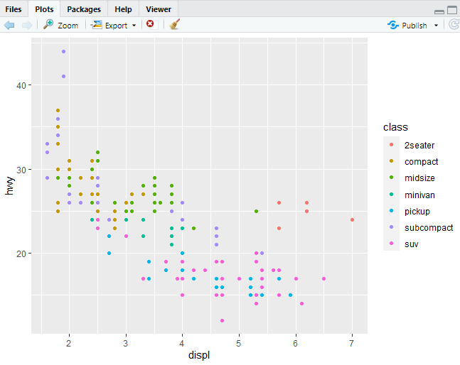

## Welcome
<hr>


- 저작권 : "R for DataScience by Hadley Wickham and Garrett Grolemund(O'Reilly). Copyright 2017 Garrett Grolemund, Hadley Wickham, 978-1-491-91039-9

<br><br><hr>

<br>

## Introduction 

- how to visualise your data using ggplot2. R 
- ggplot2는 그래프를 그려주는 프로그램 
[ggplot2 이론배경](https://byrneslab.net/classes/biol607/readings/wickham_layered-grammar.pdf)


### 3.1.1 Prerequisites


```r
install.packages("tidyverse")

library(tidyverse)
#> ── Attaching packages ─────────────────────────────────────── tidyverse 1.3.0 ──
#> ✔ ggplot2 3.3.2     ✔ purrr   0.3.4
#> ✔ tibble  3.0.3     ✔ dplyr   1.0.2
#> ✔ tidyr   1.1.2     ✔ stringr 1.4.0
#> ✔ readr   1.4.0     ✔ forcats 0.5.0
#> ── Conflicts ────────────────────────────────────────── tidyverse_conflicts() ──
#> ✖ dplyr::filter() masks stats::filter()
#> ✖ dplyr::lag()    masks stats::lag()

install.packages(c("nycflights13", "gapminder", "Lahman"))
```


### 3.2 First steps
#### 3.2.1 The mpg data frame

- US Environmental Protection Agency on 38 models of car
- A data frame is a rectangular

```r
mpg
```


- displ  = car’s engine size, in litres
- hwy = fuel efficiency in miles per gallon (mpg)

#### 3.2.2 Creating a ggplot

```r
ggplot(data = mpg) +
  geom_point(mapping = aes(x= displ, y = hwy))
```

- ggplot(data = mpg) : 비어있는 Graph를 만들어 준다. 
- geom_point() : Layers 추가
- scatterplot


- mapping = aes(x= displ, y = hwy) : x와 y를 mapping 해 준다. 

#### 3.2.3 A graphing template

    ggplot(data = <DATA>) + 
      <GEOM_FUNCTION>(mapping = aes(<MAPPINGS>))

이런 식으로 쓰면 된다고 함. (모형)


### 3.3 Aesthetic mappings

aesthetic : 래전드 모양, 색 크기
- value :  data
- level : aesthetic properties

```r
ggplot(data = mpg) +
  geom_point(mapping = aes(x = displ, y = hwy, color = class))
```




```r
ggplot(data = mpg) +
  geom_point(mapping = aes(x = displ, y = hwy, size = class))
```


 colour , color : 모두 써도 됨.

[아직 덜 했다 !](https://r4ds.had.co.nz/data-visualisation.html#a-graphing-template)


