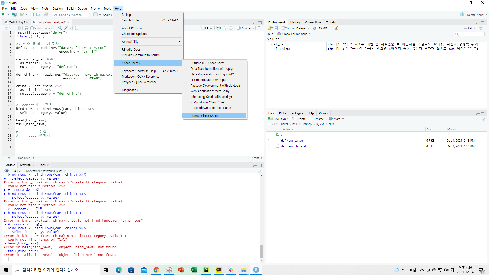

## Text Mining in R (03)

앞선 내용 :
<br>[Text Mining in R (01)](https://yoonhwa-p.github.io/2021/12/14/R/textmining(01)/)
: library(KoNLP), useNIADic() 사용/설치 확인
<br>[Text Mining in R (02)](https://yoonhwa-p.github.io/2021/12/14/R/textmining(02)/)
: Rcppmecab 설치, 확인
<br>
<br>다음 내용 :
<br>[Lecture](https://github.com/YoonHwa-P/R/blob/main/7_day_textmining/ch01_morphological_analysis.r)

<br><br>

---

### data 수집


<br><br>

---

### data  전처리 




[cheatsheets](https://www.rstudio.com/resources/cheatsheets/)


---


### Tokenize

[tidytextmining](https://www.tidytextmining.com/)

```R
install.packages("tidytext")
```


