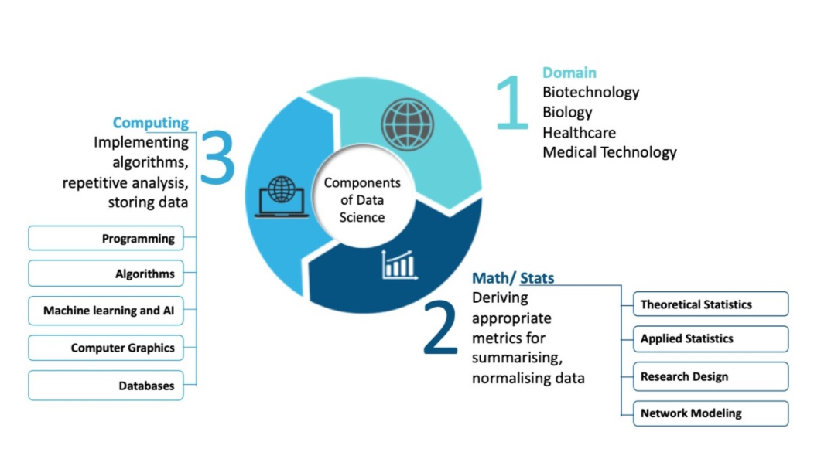
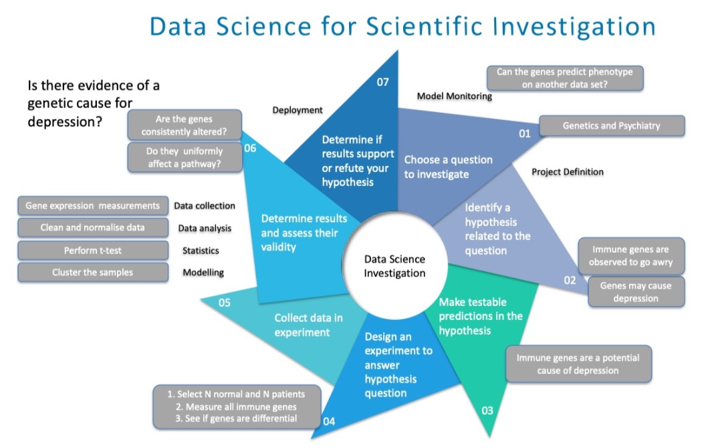
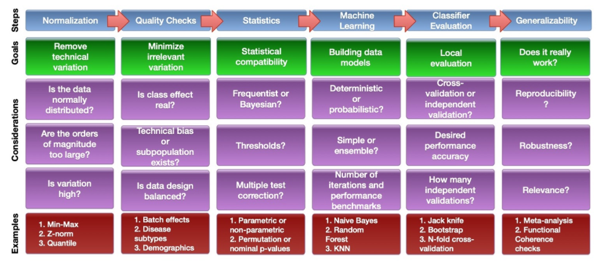

##Big data 를 이용 할 수 있는 BioData Scientist가 되고 싶다. 

 

생물학은 점점 디지털화되고 있으며 이제 양적인 과학 분야의 빛을 발하고 있다. 

핵심 추진 요인은 생물학적 연구에서 처리량이 높은 기술 플랫폼의 확산이 증가하는 것으로, 
체계적인 연구를 위해 수천 개의 조직과 유기체에 걸친 
유전자, 단백질 및 기타 생물학적 부분에 대한 수백만 개의 데이터 포인트가 
수집, 세척, 저장 및 통합될 수 있도록 한다.

이처럼 데이터가 풍부한 환경에서 생물학적(그리고 임상 샘플에 배치된 경우 생물의학) 
연구의 미래는 <strong> ***데이터의 전략적 극대화*** </strong>에 있다고 해도 과언이 아니다.

오늘날의 기술 환경에서 데이터 과학 및 인공지능(AI)은 
이미 비즈니스 및 금융과 같은 영역에서 혁신 동력으로 작용하고 있다.
여기서 데이터 과학자는 막후에서 작업하는 대신 데이터를 실질적인 
통찰력으로 변환하는 역할을 담당하고 있다. 

예를 들어, 인공지능 기반 알고리즘 거래와 금융 기술(FinTech)의 주식 추천 시스템, 
엔지니어링의 자동화 엔진 설계, 시스템 유지보수 및 로봇공학 등이 있다. 
최근의 데이터 폭발과 이에 따른 비즈니스, 금융 및 컴퓨팅과 같은 
다른 분야의 데이터 과학의 발전을 감안할 때, 우리는 특히 생물학과 관련된 영역별
문제를 다루는 새로운 변형인 빠르고 방대한 양의 데이터 생성과 함께 데이터 과학이
등장할 것으로 예상한다. 이를 **"바이오 데이터 과학"** 이라고 한다.

###BDS(BioData Science)에는 세 가지 핵심 분야가 있다. 

- 생물학 영역: Biology 
- 수학 및 통계 : mathematics (statistics)
- 컴퓨터 공학 : computer science

 

 

**생물학 영역**은 질병의 원인이나 유추된 바이오 마커의 진단 효용 이해와 같은 생물학적 기원에 대한 질문과 관련이 있다. 

**컴퓨터 과학 코어**는 특히 분석할 데이터가 큰 경우 문제 해결을 위한 적절한
알고리즘 고안, 반복 처리 (예: 데이터의 큰 부분 집합에서 
동일한 알고리즘 여러 번 실행) 및 데이터 저장 문제 해결과 관련이 있다.

**수학 및 통계 핵심 영역**은 데이터 요약, 정규화 및 모델링을 포함한 문제와 관련이 있다. 
기술 및 탐색적 통계 데이터 분석이 BDS에만 국한된 것은 아니지만
(생물 통계의 필수 구성 요소이기도 하며, 더 낮은 정도로 생물 정보학이기도 함), 
BDS는 빅데이터에 AI/ML을 적용하는 것에 기초한 신흥 기술을 이용한 예측에 초점을 맞추고 있다.

###바이오 데이터 과학은 다른 과학 분야와 다르지 않은 탐구 과학이다.
BDS는 단순히 기술(technology), 기계 학습(machine learning) 인공지능(AI)이 아니다. 

인공지능이 여러분을 위해 그렇게 해주기를 바라는 대신, 사람의 **강한 논리적 사고**에 기초해야 한다.
BDS가 궁극적으로 연구의 과학이라는 이런 점에서, 전형적인 과학적 조사와 다르지 않다. 

우리는 유전자 발현 변화가 정신 상태와 의미있게 상관되는지에 대한 질문에 답하도록 돕기 위해
다음의 7가지 단계를 사용할 수 있다. 

 

가장 큰 차이점은 BDS는 낮은 처리량 또는 저전력 물리적 실험에 대한 강조를 줄이면서 
**의미 있는 데이터 조작 및 분석에 강력한 능력**을 필요로 한다는 것이다.

    데이터 과학은 다른 과학적 추구와 같은 과정으로 진행 된다.

    - 조사할 질문을 먼저 선택
    - 테스트 가능한 관련 가설을 확인함으로써 이 질문의 범위를 넓힘
    - 가설에 답하기 위한 데이터를 얻기 위한 적절한 실험을 설계하고 현장 적용할 
    - 결과를 결정하고 그 타당성, 즉 데이터가 연구 질문에 답하는 데 적합한지 여부를 평가
    - 마지막으로, 모델을 배치하고 연구 결과가 반복 가능한지 확인
    

 

 

###데이터 분석은 복잡한 다단계 프로세스이다.
**BDS(BioData Science)**는 도전적인 분야이지만, 생물정보학이나 전산생물학과 비슷하게 어렵다.

생물학적 시스템을 측정하기 위한 기술적 플랫폼은 매우 정교하지만, 생물학적 시스템은 매우 복잡하다. 
게다가 생물학적 실체를 측정하기 위해 개발된 기술적 도구는 생물학적 시스템의 
구성요소가 변화하고 시간이 지남에 따라 자연스럽게 변화하는 동안 기술적 불확실성에 영향을 받는다.
바이오 빅 데이터는 이러한 문제에 대한 자연스러운 솔루션이 아니며 새로운 문제를 야기한다. 

 

 

BDS 데이터는 매우 많은 수의 관측에서 보존된 패턴을 식별하는 과정과 같은 데이터 과학
노력을 촉진할 수 있지만, 적절한 분석 파이프라인이 개발될 경우에만 그렇게 할 수 있다.
이 작업은 하찮지 않다. 이러한 분석 파이프라인은 데이터 수집에서 시작하여 
더 높은 수준의 생물학적 해석과 통찰력을 향한 계산 및 통계 평가를 통해 계속 이어지는 
다양한 접근 방식의 엔드 투 엔드 통합으로 상상할 수 있다.

 

- omics 데이터의 바이오 마커 분석을 위한 단순화된 파이프라인과 관련 주요 고려 사항은 다음과 같을 수 있다.

    

 

분석 파이프라인은 매우 유연해야 하며 연구 질문의 필요에 따라 변화해야 한다.
완벽한 지식이 부족하기 때문에 최적화와 재현성을 어느 정도 달성하기 위해 몇 단계를 왔다 갔다
반복하고 다듬는 것도 일반적이다.

예를 들어, 정규화 단계에서 두 개의 서로 다른 정규화 절차를 
사용하여 매우 다르고 겹치지 않는 차등 유전자 세트를 발견했다고 가정 해 보자. 
정규화 절차는 데이터에 대해 잘못된 가정을 하거나 잘못 구현되었을 수 있다. 
표시된 주요 고려사항은 엄청나게 많다. 고려사항의 예와 함께 단계를 보여주는 목적은 
각 단계마다 완벽한 시스템이나 파이프라인이 없지만, 각 의사결정 지점마다 이후 단계에 대한 
결과를 갖는 많은 고려사항이 있음을 입증하는 것이다.

우리는 또한 특정 정규화 접근법이 다운스트림 통계 절차와 잘 작동하는지와 같은 
호환성 문제나 특정 절차가 배치 효과 보정 알고리즘 및 일부 다중 시험 보정 방법과 관련된 
과다 탈락 및 과다 첨가로 이어질 수 있는지 여부와 같은 문제를 걱정해야 한다.

일반적으로 좋은 결과를 보장하는 노선도나 표준 운영 절차는 없다는 점에서 
BDS는 예술에 가까운 과학인 것이다. 

Ref.
https://gohwils.github.io/biodatascience/biodatascience.html