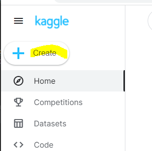

# google colab에서 실행되지 않는 

google colab에서 version 오류로 실행 되지 않는 것들이 있다고 한다. 
따라서 이때 Kaggle data를 이용 할 예정이면 Kaggle Note를 사용해 보는 것은 어떨까?




 '+ Create' 표시를 누른다. 

    - New NoteBook
    - New dataSet

탭이 나온다. 

New NoteBook을 선택하여 이용해 보자.

---

아래와 같은 코드가 나오게 된다. 


``` python
# This Python 3 environment comes with many helpful analytics libraries installed
# It is defined by the kaggle/python Docker image: https://github.com/kaggle/docker-python
# For example, here's several helpful packages to load

import numpy as np # linear algebra
import pandas as pd # data processing, CSV file I/O (e.g. pd.read_csv)

# Input data files are available in the read-only "../input/" directory
# For example, running this (by clicking run or pressing Shift+Enter) will list all files under the input directory

import os
for dirname, _, filenames in os.walk('/kaggle/input'):
    for filename in filenames:
        print(os.path.join(dirname, filename))

# You can write up to 20GB to the current directory (/kaggle/working/) that gets preserved as output when you create a version using "Save & Run All" 
# You can also write temporary files to /kaggle/temp/, but they won't be saved outside of the current session


```


이것을 유지 한채 아래에 code 연습을 하면 되는 것 같다. 

21.11.05_