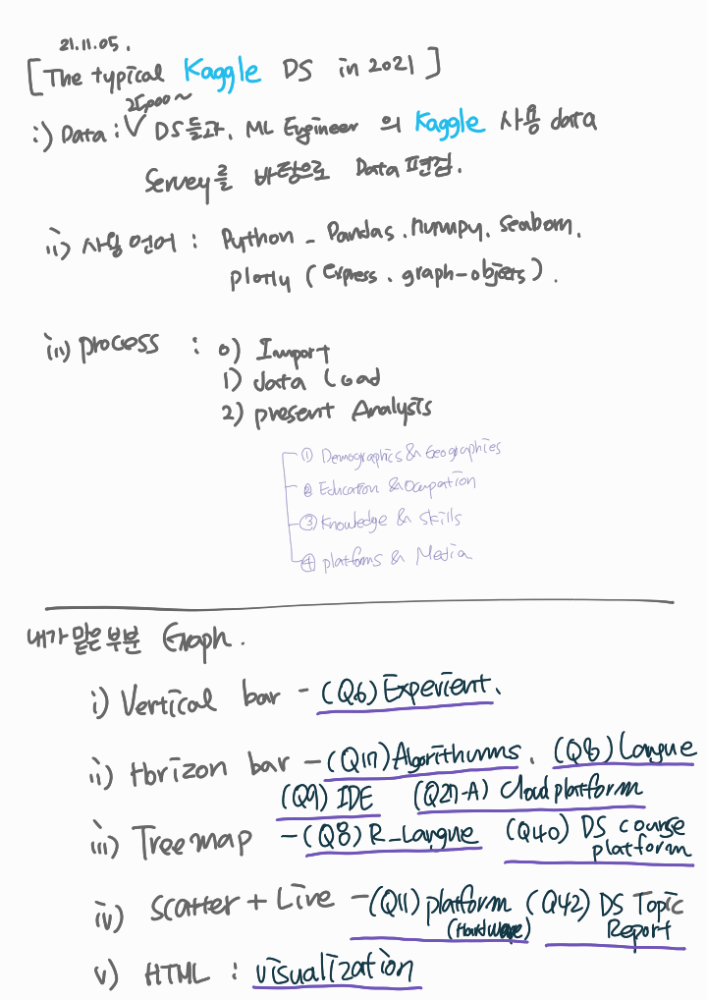
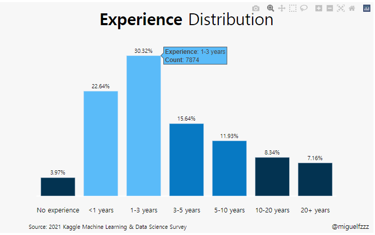

```python


# This Python 3 environment, PKG Load
import numpy as np # linear algebra
import pandas as pd # data processing, CSV file I/O (e.g. pd.read_csv)

# Input data files : "../input/" 
# Running : Shift+Enter

import os
for dirname, _, filenames in os.walk('/kaggle/input'):
    for filename in filenames:
        print(os.path.join(dirname, filename))

# ~ 20GB ,/kaggle/temp/


```

    /kaggle/input/kaggle-survey-2021/kaggle_survey_2021_responses.csv
    /kaggle/input/kaggle-survey-2021/supplementary_data/kaggle_survey_2021_methodology.pdf
    /kaggle/input/kaggle-survey-2021/supplementary_data/kaggle_survey_2021_answer_choices.pdf
    

<center style="font-size:200%; font-family:Hiragino Kaku Gothic Pro, sans-serif"><b> The Typical Kaggle Data Scientist in 2021</b></center>

<br><br>

<center style="font-size:200%; font-family:Hiragino Kaku Gothic Pro, sans-serif"> Remade By @YoonHwa-P</center>

<center></center>

HTML code는 Markdown 형식으로 넣을 수 있게 해 준다.

scr : [구글 팟케스트](https://www.gcppodcast.com/)에서 바로 연결하여 사용.


```python
import pandas as pd
import numpy as np
import seaborn as sns
import plotly.express as px
import plotly.graph_objects as go

import warnings
warnings.filterwarnings('ignore')


```

시각화, 계산을 위해 Pandas, Numpy, seaborn을 이용 할 것이고, 동적보드를 만들기 위해 plotly를 이용 하였다. 

plotly 중에서 Express와 Graph_objects를 가져와서 사용 할 예정인듯.

[plotly-express](https://plotly.com/python/plotly-express/)

The Plotly Express API in general offers the following features:

Every PX function returns a** plotly.graph_objects.Figure object**, so you can edit it using all the same methods like update_layout and add_trace.

input으로 Express를 사용 한다면  Graph_objects가 동적 plotly 를 만드는 것 같다. : update 하거나 trace를 가능 하게 하는듯.


실제 필사할  data에서는 어떤 data가 있는지 확인 해 보지 않았지만, 
나는 배우는 입장이니 어떤 data가 있는지, 어떤 head가 있는지 확인 해 보도록 한다. 

맨 위에 가보면 Note가 생성 될때 

    /kaggle/input/kaggle-survey-2021/kaggle_survey_2021_responses.csv
    /kaggle/input/kaggle-survey-2021/supplementary_data/kaggle_survey_2021_methodology.pdf
    /kaggle/input/kaggle-survey-2021/supplementary_data/kaggle_survey_2021_answer_choices.pdf

위와같은 file dir을 알려준다. 이제, pandas로 이 files를 로딩 시켜 주면된다. 

Ref. [Kaggle활용.국문](https://teddylee777.github.io/kaggle/kaggle%EC%97%90%EC%84%9C-%EC%A0%9C%EA%B3%B5%ED%95%98%EB%8A%94-notebook-%ED%99%9C%EC%9A%A9%ED%95%98%EA%B8%B0)


```python
df = pd.read_csv("../input/kaggle-survey-2021/kaggle_survey_2021_responses.csv")
df = df.iloc[1:, :] #이건 왜 선택 해 놓은 것일까요?
df.head()

df.info()


```

    <class 'pandas.core.frame.DataFrame'>
    RangeIndex: 25973 entries, 1 to 25973
    Columns: 369 entries, Time from Start to Finish (seconds) to Q38_B_OTHER
    dtypes: object(369)
    memory usage: 73.1+ MB
    

df에 pd.read_csv로 csv file을 읽어 옵니다. 

역시 pd인 df객체에 iloc을 이용하여 \[ 1행부터 : , : \] iloc를 선택 해 놓았다. 


1. 행번호(row number)로 선택하는 방법 **(.iloc)**
2. label이나 조건표현으로 선택하는 방법 (.loc)

Ref. [loc를 이용한 행 선택](https://azanewta.tistory.com/34)

<br>

<center style="font-size:300%; font-family:Hiragino Kaku Gothic Pro, sans-serif"> 0. Introduction</center>
<br>

<div style="font-size:130%; font-family:Hiragino Kaku Gothic Pro, sans-serif"> 
    
This notebook will explore the fascinating results obtained from the survey conducted by Kaggle in September 2021. Over 25,000 data scientists and ML engineers participated, providing information on their backgrounds and experience in their occupations. <br>

To increase readability, this report is divided into four sections: </div>
    
1. <div style="font-size:130%; font-family:Hiragino Kaku Gothic Pro, sans-serif">Demographics & Geographics</div>

2. <div style="font-size:130%; font-family:Hiragino Kaku Gothic Pro, sans-serif">Education & Occupation </div>

3. <div style="font-size:130%; font-family:Hiragino Kaku Gothic Pro, sans-serif">Knowledge & Skills</div>

4. <div style="font-size:130%; font-family:Hiragino Kaku Gothic Pro, sans-serif">Platforms & Media</div>

<br>

***

Introduction 
이 노트북은 25000 data scientist들과 ML Engineer들의 kaggle에서 경험 한것을 조사한 data를  매력적인 결과로 탐험 하게 될 것이다. 
(대충)

; Introduction 에서 이 notebook의 성격, data의 간간한 정보, 목차 등을 설명.


<hr>

모든 글은 Markdown을 이용한 css 로 작성 된 것 같다. 

<br>


```python
experience = (
    df['Q6']
    .value_counts()
    .to_frame()
    .reset_index()
    .rename(columns={'index':'Experience', 'Q6':'Count'})
    .replace(['I have never written code','< 1 years',
              '1-3 years', '3-5 years', '5-10 years',
              '10-20 years', '20+ years'], ['No experience', '<1 years',
                                        '1-3 years', '3-5 years', '5-10 years',
                                        '10-20 years', '20+ years'])
          ) 
```


```python
 df['Q6'].value_counts()  
#여러개의 fuction을 사용 하기 위해서 괄호로 묶어서 사용 
```


    1-3 years                    7874
    < 1 years                    5881
    3-5 years                    4061
    5-10 years                   3099
    10-20 years                  2166
    20+ years                    1860
    I have never written code    1032
    Name: Q6, dtype: int64


1. .value_counts() : 데이터의 분포도를 확인하는데 매우 유용한 함수
  - column 값의 개수를 확인 하는것.
2. .to_frame() : 
   .rename(columns={'index':'Experience', 'Q6':'Count'}) 
3. reset_index()
  - Index를 reset해 준다. 
  
  Ref. [판다스 함수](https://hun931018.tistory.com/19)


## data 수집, 전처리 
Experience라는 Question 6에 해당하는 값을 전처리 해 준다. 


## data categoircal로 List로 만들고, 함수정의, 정렬


```python
#1
experience['Experience'] = pd.Categorical(
                                        experience['Experience'], 
                                        ['No experience', '<1 years',
                                        '1-3 years', '3-5 years', '5-10 years',
                                        '10-20 years', '20+ years']
                                         )
                                         
#2
experience['percent'] = ((experience['Count'] / experience['Count'].sum())*100).round(2).astype(str) + '%'
#3
experience = experience.sort_values('Experience')
#4
colors = ['#033351',] * 7
colors[1] = '#5abbf9'
colors[2] = '#5abbf9'
colors[3] = '#0779c3'
colors[4] = '#0779c3'

#5
fig = go.Figure(go.Bar(
            y=experience['Count'],
            x=experience['Experience'],
            cliponaxis = False,
            text=experience['percent'],
            marker_color=colors
                        ))
#6
fig.update_traces(texttemplate='%{text}', 
                  textposition='outside',
                  hovertemplate='<b>Experience</b>: %{x}<br><extra></extra>'+
                                '<b>Count</b>: %{y}', textfont_size=12)

#7
fig.update_xaxes(showgrid=False)
fig.update_yaxes(showgrid=False)

#8
fig.update_layout(showlegend=False, 
                  plot_bgcolor='#F7F7F7', 
                  margin=dict(pad=20),
                  paper_bgcolor='#F7F7F7',
                  height=500,
                  yaxis={'showticklabels': False},
                  yaxis_title=None,
                  xaxis_title=None,
                  title_text="<b>Experience</b> Distribution",
                  title_x=0.5,
                  font=dict(family="Hiragino Kaku Gothic Pro, sans-serif", size=14, color='#000000'),
                  title_font_size=35)

fig.add_annotation(dict(font=dict(size=14),
                                    x=0.98,
                                    y=-0.24,
                                    showarrow=False,
                                    text="@miguelfzzz",
                                    xanchor='left',
                                    xref="paper",
                                    yref="paper"))

fig.add_annotation(dict(font=dict(size=12),
                                    x=-0.03,
                                    y=-0.24,
                                    showarrow=False,
                                    text="Source: 2021 Kaggle Machine Learning & Data Science Survey",
                                    xanchor='left',
                                    xref="paper",
                                    yref="paper"))
fig.show()
```




<hr>


## 1 : Pandas lib의 categories  function 
문자열 객체의 배열을 series로 변환하여 범주형으로 변환   <br>
[pd.categories](https://steadiness-193.tistory.com/233)

## 2 : experience['percent'] 
수식 지정 Experience의 percent 계산은 이렇게 하겠다. 

## 3 : experience.sort_values
데이터 정렬하기 : 컬럼의 data를 기준으로 정렬
    - short_Index의 경우에는 Index를 기준으로 data를 정렬한다. 
[Short_value](https://hogni.tistory.com/6)

## 4 : color
바chart의 color을 설정 해 주는 것 같은데 아직 잘 모르겠음.
[chart color](https://pandas.pydata.org/docs/reference/api/pandas.DataFrame.plot.bar.html)

## 5 :  fig = go.Figure(go.Bar())
<a style = "font-color: red">import plotly.graph_objects as go </a>이기 때문에 fig는 plotly를 이용하여 만든듯.

1) x축, y축 정해주기 <br>

y=experience['Count'],
x=experience['Experience'],

<br>

2) clipon axis
cliponaxis = False,
cliponaxis – Text node를 아래 축에 고정 할지 아닐지 결정
text node를 축 라인과 체크라벨 위에 보여주기위해서는 x축Layer와 y축 layer 설정을 해 주어야 한다.  

<br>

3)
text=experience['percent'],

4)
marker_color=colors 
<br>
ref. <br>
[plotly.graph_object Parameter](https://plotly.com/python-api-reference/generated/plotly.graph_objects.Figure.html)  <br>
[var chart in plotly](https://plotly.com/python/bar-charts/)  <br>


## 6 : fig.update_traces()
그래프 위에 캡션 다는 기능
Perform a property update operation on all traces that satisfy the specified selection criteria
<br>
지정된 선택 기준을 충족하는 모든 추적에 대해 속성 업데이트 작업 수행 (?? 전혀 모르겠군 !)
<br>
texttemplate='%{text}', 
textposition='outside',
hovertemplate='<b>Experience</b>: %{x}<br><extra></extra>'+
                                '<b>Count</b>: %{y}',textfont_size=12)
<br>

 - texttemplate='%{text}', : text type
 - textposition='outside', : inside하면 그래프 안쪽, ouside 하면 그래프 위쪽에 생성
 - hovertemplate= 커서를 가까이 대면 나오는 창 x값과, y 값이 어떤 상태인지 알려 준다. 
 
 [hevertemplate](https://plotly.com/python/hover-text-and-formatting/)
 
Returns the Figure object that the method was called on  <br>
메서드가 호출된 그림객체를 반환.  <br>


[plotly.graph_objects.Figure.update_traces](https://plotly.com/python-api-reference/generated/plotly.graph_objects.Figure.html#plotly.graph_objects.Figure.update_traces)  <br>

## 7 : 
fig.update_xaxes(showgrid=False)
fig.update_yaxes(showgrid=False)


축을 보이지 않는 형태로 바꾸어 예쁘게 보이게 해줌.


## 8 : 

[plotly.graph_objects.Figure.update_layout](https://plotly.com/python-api-reference/generated/plotly.graph_objects.Figure.html#plotly.graph_objects.Figure.update_layout)


