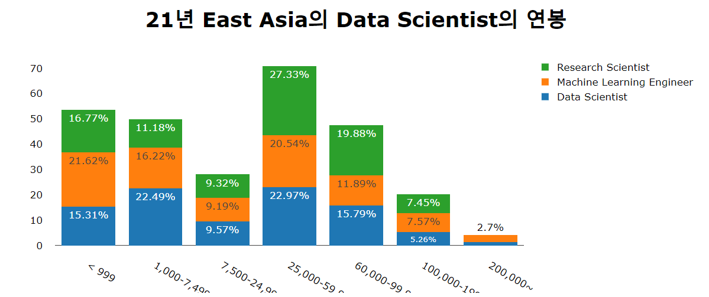
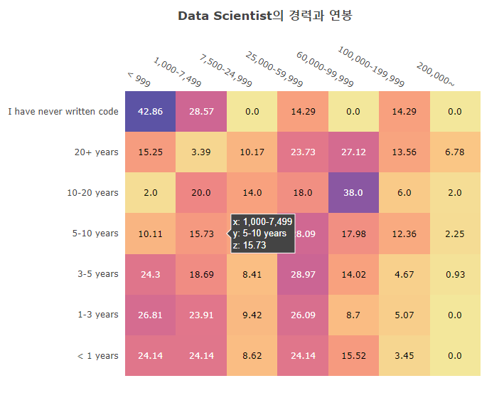
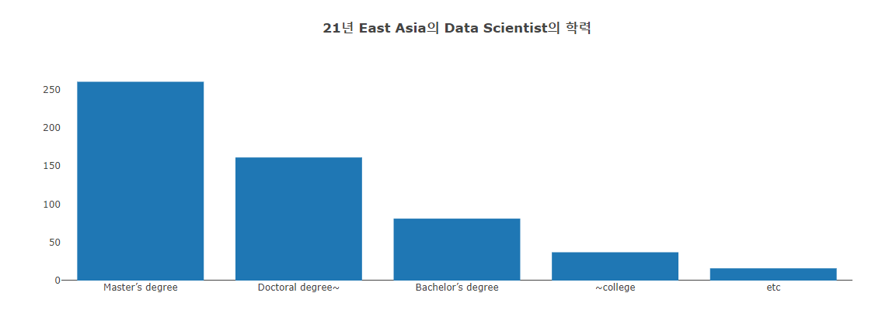
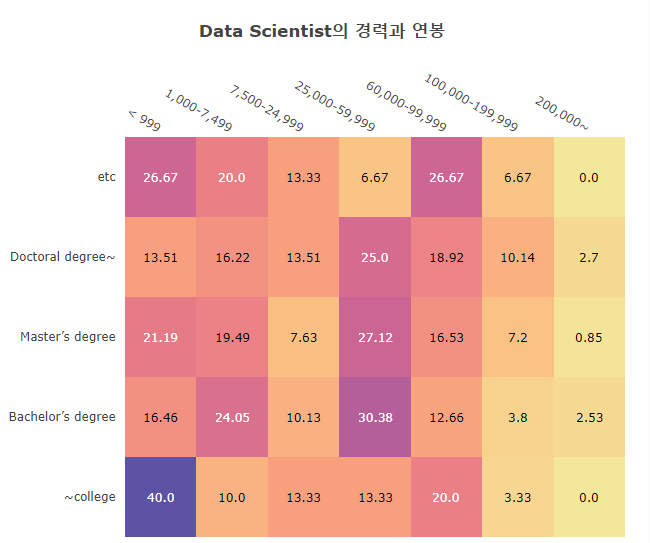
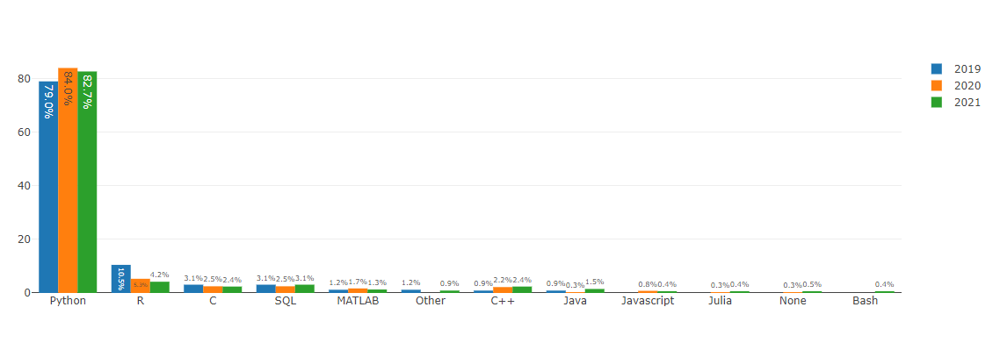

# Data scientist in East Asia

<br><br>
<hr>


## Data scientist로써 East Asia 에서 살아 남아보자 !


### Data Import

#### East asia data에서 DS(Data scientist)뽑아내기 

```python
# 21년 EastAsia 의 Data Scientist
# 21년 EastAsia의 Data Scientist는 'Data Scientist', 'Machine Learning Engineer', 'Scientist/Researcher'
# Data_Scientist =['Data Scientist',  'Research Scientist', 'Researcher','Machine Learning Engineer', 'Scientist/Researcher']
df21_Ea_DS = df21_Ea[df21_Ea['Q5'].isin(Data_Scientist)]
#21년 EastAsia의 Data Scientist 설문조사 응답자 리스트 

dgree_order=[ '~college','Bachelor’s degree', 'Master’s degree', 'Doctoral degree~', 'etc']
sal_order=['< 999', '1,000-7,499', '7,500-24,999', '25,000-59,999', '60,000-99,999','100,000-199,999', '200,000~']

df21_Ea_DS=(df21_Ea_DS.replace(['0-999','$0-999','0'], '< 999')
          .replace({'>$1,000,000':'200,000~'})
          .replace(['1,000-1,999','2,000-2,999','3,000-3,999', 
        '4,000-4,999','5,000-7,499'],'1,000-7,499')
          .replace(['7,500-9,999','10,000-14,999', '15,000-19,999', 
        '20,000-24,999'],'7,500-24,999')
          .replace(['25,000-29,999','30,000-39,999', '40,000-49,999', 
        '50,000-59,999'],'25,000-59,999') 
           .replace(['60,000-69,999', '70,000-79,999', '80,000-89,999', 
        '90,000-99,999'], '60,000-99,999')
          .replace(['100,000-124,999', '300,000-499,999',
        '125,000-149,999', '125,000-149,999',
        '150,000-199,999'],'100,000-199,999')
          .replace(['200,000-249,999', '250,000-299,999', 
        '1,000,000','$500,000-999,999'], '200,000~')
           .replace({'I prefer not to answer':'etc'}).replace(['No formal education past high school',
                       'Some college/university study without earning a bachelor’s degree'],'~college')
             .replace(['Doctoral degree',
                       'Professional doctorate'],'Doctoral degree~'))
```

#### replace.()

- replace.()를 data를 뽑아 내면서 사용 하면, 편하다. 
- 다음 project 부터는 그렇게 사용하자!
- 순차적으로 적용 하더라도 replace.()는 맨 앞에 사용하자.
- data를 정제할 때 구획을 어디서 나누느냐는 **presentation**에 중요한 구성 요소이다.(강조할 부분이 바뀐다.)

<br>
<hr>
<br>


### Ds의 연봉 뽑아내기


```python
df21_Ea_DS_= df21_Ea_DS.loc[:,['Q5','Q25']].reset_index().rename(columns={'Q5':'Data_Scientist', 'Q25':'Salary'}).fillna('etc')
df21_Ea_DS_= (df21_Ea_DS_.groupby(['Data_Scientist', 'Salary']).size()
           .reset_index()
           .rename(columns = {0:"Count"})
             )


#Data Scientist
df21_Ea_DS_Ds = df21_Ea_DS_[df21_Ea_DS_['Data_Scientist'] == "Data Scientist"].reset_index(drop = True)
df21_Ea_DS_Ds['%']=((df21_Ea_DS_Ds['Count'] / df21_Ea_DS_Ds['Count'].sum())*100).round(2)
# Salary21_Ea=Salary21_Ea.sort_values(by='%', ascending=False)

#Machine Learning Engineer
df21_Ea_DS_Mle = df21_Ea_DS_[df21_Ea_DS_['Data_Scientist'] == "Machine Learning Engineer"].reset_index(drop = True)
df21_Ea_DS_Mle['%']=((df21_Ea_DS_Mle['Count'] / df21_Ea_DS_Mle['Count'].sum())*100).round(2)

#Research Scientist
df21_Ea_DS_Rs = df21_Ea_DS_[df21_Ea_DS_['Data_Scientist'] == "Research Scientist"].reset_index(drop = True)
df21_Ea_DS_Rs['%']=((df21_Ea_DS_Rs['Count'] / df21_Ea_DS_Rs['Count'].sum())*100).round(2)
df21_Ea_DS_Rs


df21_Ea_DS_salary = pd.concat([df21_Ea_DS_Ds, df21_Ea_DS_Mle, df21_Ea_DS_Rs], ignore_index = True)
df21_Ea_DS_salary= pd.pivot(df21_Ea_DS_salary, index = "Salary", columns = 'Data_Scientist', values = "%").reset_index().fillna('0')
df21_Ea_DS_salary= df21_Ea_DS_salary.set_index("Salary").reindex(sal_order)


```

뽑아낸 data를 합쳐서 하나의 표로 만든다. 

Excel에서 하는게 더 편하고 익숙하지만, 
python을 능숙 하게 다룰 수 잇는 언젠가가 오지 않을까 싶다. 
<br><br>
<hr>

### Ds의 연봉 bar graph 만들기

```python

fig = go.Figure()

fig.add_trace(go.Bar(x = df21_Ea_DS_salary.index, 
                     y = df21_Ea_DS_salary['Data Scientist'], 
                     name = "Data Scientist", 
                     text = df21_Ea_DS_salary['Data Scientist'].astype(str) + "%", 
                     textposition='auto'))

fig.add_trace(go.Bar(x = df21_Ea_DS_salary.index, 
                     y = df21_Ea_DS_salary['Machine Learning Engineer'], 
                     name = "Machine Learning Engineer", 
                     text = df21_Ea_DS_salary['Machine Learning Engineer'].astype(str) + "%", 
                     textposition='auto'))

fig.add_trace(go.Bar(x = df21_Ea_DS_salary.index, 
                     y = df21_Ea_DS_salary['Research Scientist'], 
                     name = "Research Scientist", 
                     text = df21_Ea_DS_salary['Research Scientist'].astype(str) + "%", 
                     textposition='auto'))


fig.update_layout(barmode='stack',
                 showlegend=True,
                 margin=dict(pad=20),
                 height=500,
                 yaxis_title=None,
                 xaxis_title=None,
                 title_text="<b>21년 East Asia의 Data Scientist의 연봉</b>",
                 title_x=0.5,
                 font=dict(size=17, color='#000000'),
                 title_font_size=35)

fig.update_xaxes(showgrid=False)
fig.update_yaxes(showgrid=False)
fig.show()
```





+ [25,000-59,999] 이 구간이 East asia의 data scientist 들의 빈도가 가장 높은 연봉 구간이다. 
+ [7,500-24,999] 이 구간을 없애버리고 싶지만 (편입), 우선은 그냥 두기로 한다. 


### HeatMap을 그려보자
#### East asia의 DS들의 연봉과 경력간의 관계를 알아보고자 한다. 

```python
df21Ea_DS_ExSal = df21_Ea_DS.loc[:,['Q6','Q25']].reset_index().rename(columns={'Q25':'Salary', 'Q6':'Exp'}).fillna('etc')
df21Ea_DS_ExSal= (df21Ea_DS_ExSal.groupby(['Exp', 'Salary']).size().unstack().fillna(0).astype('int64'))
# df21Ea_DS_ExSal['Exp'].unique()
Exp_order=['< 1 years','1-3 years','3-5 years', '5-10 years', '10-20 years', '20+ years', 'I have never written code']

df21Ea_DS_ExSal


z = df21Ea_DS_ExSal
z = z[sal_order]
z = z.reindex(Exp_order)

z_data = z.apply(lambda x:np.round(x/x.sum()*100, 2), axis = 1).to_numpy() # convert to correlation matrix
x = sal_order
y = Exp_order

fig = ff.create_annotated_heatmap(z_data, x = x, y = y, colorscale = "sunset")
fig.update_layout( title_text="<b>Data Scientist의 경력과 연봉 </b>",
                  height=700, width=800,
                 title_x=0.5,
                  margin=dict(l=200, r=100, t=200, b=100))
fig.show()
```




<br>

- data Scientist의 경력과 연봉 상관관계를 Heatmap으로 그렸다. 
- 정말 재미있는 사실은 [7,500-24,999], [60,000-99,999] 등의 구간이 비어 보인다. 
  - 혹시 연봉이 반올림되는 구간이 아닐까 생각한다. 
  - 다음에 연봉 구획을 다시 나눈다면 이런 부분을 신경쓰면서 나누어야 할 듯.
- [<999] 구간은 생각보다 비율이 높은 걸을 알 수 있는데 이는 survey의 오류인듯 하다. 
  - 연봉인데 월급으로 생각했다던가... 


<br><br>
<hr>


```python
df21_Ea_degree = df21_Ea_DS['Q4'].value_counts().to_frame()
degree = df21_Ea_degree.index
values = df21_Ea_degree['Q4'].tolist()

fig = go.Figure(data=[
    go.Bar(name='Degree', x=degree, y=values ,orientation='v')])


fig.update_layout(
                 title_text="<b>21년 East Asia의 Data Scientist의 학력</b>",
                 )
fig.update_xaxes(showgrid=False)
fig.update_yaxes(showgrid=False)
fig.show()
```





<br><br>
<hr>


```python
df21Ea_DS_EduSal= df21_Ea_DS.loc[:, ['Q4', 'Q25']].rename(columns={'Q4':'Edu', 'Q25':'Salary'})
df21Ea_DS_EduSal['Edu'].unique()
Edu_order=['~college', 'Bachelor’s degree','Master’s degree', 'Doctoral degree~', 'etc']

df21Ea_DS_EduSal= (df21Ea_DS_EduSal.groupby(['Edu', 'Salary']).size().unstack().fillna(0).astype('int64'))
df21Ea_DS_EduSal


z = df21Ea_DS_EduSal
z = z[sal_order]
z = z.reindex(Edu_order)

z_data = z.apply(lambda x:np.round(x/x.sum()*100, 2), axis = 1).to_numpy() # convert to correlation matrix
x = sal_order
y = Edu_order

fig = ff.create_annotated_heatmap(z_data, x = x, y = y, colorscale = "sunset")
fig.update_layout( title_text="<b>Data Scientist의 경력과 연봉 </b>",
                  height=700, width=800,
                 title_x=0.5,
                  margin=dict(l=200, r=100, t=200, b=100))
fig.show()
```



- East Asia의 ds들의 연봉은 거의 [25000-60000] 구간에 들어잇는 것 같다. 
- 학위랑은 많이 상관 없어 보이며
- 심지어 200,000~$를 받는 학사학력자가 있다. 몹시 바람직하다. 

<br><br>
<hr>


```python
df20_Ea_DS = df20_Ea[df20_Ea['Q5'].isin(Data_Scientist)]
df19_Ea_DS =df19_Ea[df19_Ea['Q5'].isin(Data_Scientist)]
df19Ea_DSLag = df19_Ea_DS.loc[:, [ 'Q5', 'Q19', 'year']]
df19Ea_DSLag = df19Ea_DSLag.rename(columns = {'Q19': 'Language'}, inplace = False) # To match with other datasets
df20Ea_DSLag = df20_Ea_DS.loc[:, [ 'Q5', 'Q8', 'year']].rename(columns = {'Q8': 'Language'}, inplace = False)
df21Ea_DSLag = df21_Ea_DS.loc[:, [ 'Q5', 'Q8', 'year']].rename(columns = {'Q8': 'Language'}, inplace = False)


df3y_Ds_Lag = pd.concat([df19Ea_DSLag, df20Ea_DSLag, df21Ea_DSLag])
df3y_Ds_Lag = df3y_Ds_Lag.groupby(['year', 'Language']).size().reset_index().rename(columns = {0:"Count"})
df3y_Ds_Lag


# 2019
dfLang_Ds_19 = df3y_Ds_Lag[df3y_Ds_Lag['year'] == "2019"].reset_index(drop = True)
dfLang_Ds_19['percentage'] = dfLang_Ds_19["Count"] / dfLang_Ds_19["Count"].sum()
dfLang_Ds_19['%'] = np.round(dfLang_Ds_19['percentage'] * 100, 1)

# 2020
dfLang_Ds_20 = df3y_Ds_Lag[df3y_Ds_Lag['year'] == "2020"].reset_index(drop = True)
dfLang_Ds_20['percentage'] = dfLang_Ds_20["Count"] / dfLang_Ds_20["Count"].sum()
dfLang_Ds_20['%'] = np.round(dfLang_Ds_20['percentage'] * 100, 1)

# 2021
dfLang_Ds_21 = df3y_Ds_Lag[df3y_Ds_Lag['year'] == "2021"].reset_index(drop = True)
dfLang_Ds_21['percentage'] = dfLang_Ds_21["Count"] / dfLang_Ds_21["Count"].sum()
dfLang_Ds_21['%'] = np.round(dfLang_Ds_21['percentage'] * 100, 1)

dfLang_Ds_19=dfLang_Ds_19.sort_values(by='%', ascending=False)
dfLang_Ds_20=dfLang_Ds_20.sort_values(by='%', ascending=False)
dfLang_Ds_21=dfLang_Ds_21.sort_values(by='%', ascending=False)


fig = go.Figure()

fig.add_trace(go.Bar(x = dfLang_Ds_19['Language'], 
                     y = dfLang_Ds_19['%'], 
                     name = "2019", 
                     text = dfLang_Ds_19['%'].astype(str) + "%", 
                     textposition='auto'))

fig.add_trace(go.Bar(x = dfLang_Ds_20['Language'], 
                     y = dfLang_Ds_20['%'], 
                     name = "2020", 
                     text = dfLang_Ds_20['%'].astype(str) + "%", 
                     textposition='auto'))

fig.add_trace(go.Bar(x = dfLang_Ds_21['Language'], 
                     y = dfLang_Ds_21['%'], 
                     name = "2021", 
                     text = dfLang_Ds_21['%'].astype(str) + "%", 
                     textposition='auto'))


fig.show()
```





이 plot은 강사쌤의 도움을 많이 받았다. 

2017, 2018년도도 넣고 싶었으나 data 찾는데 너무 시간이 많이 걸리는 것이

대회 마감이 얼마 남지 않은 이 시점에서 바람직 하지 못한 계획이라는 생각이 들어 

이쯤에서 만족 하기로 했다. 

<br><br><hr><br>


비록 이 대회에서 우승 하지 못하겠지만, 
나에게 있어 이번 대회는 의미가 크다. 

내 경력에는 큰 의미가 없을지언정 ㅎㅎ

<br><br><hr>
