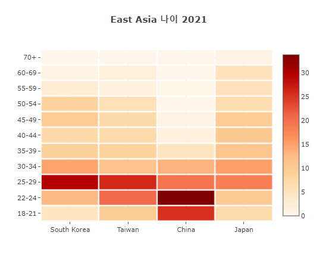

#Kgg 대회 준비
## Scatter와 bar가 함께 있는 Graph를 그려 보았다.


```python
fig = go.Figure()
y=[len(df17_Ea),len(df18_Ea), len(df19_Ea),len(df20_Ea),len(df21_Ea)]
fig.add_trace(go.Bar(x=years, y=y,
                base=0,
                marker_color='#D9946C',
                      yaxis = "y1",
                name='East Asia',
                text= percent,
                texttemplate='%{text}  %', 
                  textposition='outside',
                  hovertemplate='<b>KaggleUser</b>: %{x}<br>'+
                                '<b>Count</b>: %{y}',
                  textfont_size=14
                ))
fig.add_trace(
    go.Scatter(name = "World",
           x=years, 
            y=[len(df17), len(df18), len(df19), len(df20), len(df21)],
               marker_color='#88BFBA',
           mode = 'lines+markers', # please check option here
           yaxis = "y2"))

fig.update_layout(yaxis  = dict(title = "KaggleUser in World", showgrid = False, range=[0, len(df21_Ea)*1.2]),
                  yaxis2 = dict(title = "KaggleUser in East Asia", overlaying = "y1", side = "right", showgrid = False, 
                                zeroline = False, 
                                range=[0, len(df21)*1.2]), # This code solves the different zero set but with same zero values.
                  template = "plotly_white", height=500, width=700,)

fig.show()
```


## age data , 연도별로

```python
#age data 전처리
# age 뽑아오기
Age21_W = df21.loc[:,['Q3','Q1', 'year']].reset_index().rename(columns={'Q3':'East_Asia', 'Q1':'age'}).fillna('etc')
Age20_W = df20.loc[:,['Q3','Q1','year']].reset_index().rename(columns={'Q3':'East_Asia', 'Q1':'age'}).fillna('etc')
Age19_W = df19.loc[:,['Q3','Q1','year']].reset_index().rename(columns={'Q3':'East_Asia', 'Q1':'age'}).fillna('etc')
Age18_W = df18.loc[:,['Q3','Q2','year']].reset_index().rename(columns={'Q3':'East_Asia', 'Q2':'age'}).fillna('etc')

#data 정제(한꺼번에 이름바꾸기)
Age5y_W= pd.concat([Age21_W, Age20_W, Age19_W, Age18_W])
Age5y_W= (Age5y_W.replace(['60-69', '70+', '70-79', '80+'], '60+')
           .replace(['22-24', '25-29'], '22-29')
           .replace(['30-34', '35-39'], '30-39')
            .replace(['40-44', '45-49'], '40-49')
        .replace(['50-54', '55-59'], '50-59')
           .groupby(['year', 'age'])
           .size()
           .reset_index()
           .rename(columns = {0:"Count"}))

#percent data 넣기
Age21_percent_W = Age5y_W[Age5y_W['year'] == "2021"].reset_index(drop = True)
Age21_percent_W['percentage'] = Age21_percent_W["Count"] / Age21_percent_W["Count"].sum()
Age21_percent_W['%'] = np.round(Age21_percent_W['percentage'] * 100, 1)


Age20_percent_W = Age5y_W[Age5y_W['year'] == "2020"].reset_index(drop = True)
Age20_percent_W['percentage'] = Age20_percent_W["Count"] / Age20_percent_W["Count"].sum()
Age20_percent_W['%'] = np.round(Age20_percent_W['percentage'] * 100, 1)


Age19_percent_W = Age5y_W[Age5y_W['year'] == "2019"].reset_index(drop = True)
Age19_percent_W['percentage'] = Age19_percent_W["Count"] / Age19_percent_W["Count"].sum()
Age19_percent_W['%'] = np.round(Age19_percent_W['percentage'] * 100, 1)


Age18_percent_W = Age5y_W[Age5y_W['year'] == "2018"].reset_index(drop = True)
Age18_percent_W['percentage'] = Age18_percent_W["Count"] / Age18_percent_W["Count"].sum()
Age18_percent_W['%'] = np.round(Age18_percent_W['percentage'] * 100, 1)


#data 완성
Age5y_percent_W = pd.concat([Age18_percent_W, Age19_percent_W, Age20_percent_W, Age21_percent_W], ignore_index = True)
Age5y_percent_W= pd.pivot(Age5y_percent_W, index = "year", columns = 'age', values = "%").reset_index()
Age5y_percent_W


#age data 전처리
# age 뽑아오기
Age21 = df21_Ea.loc[:,['Q3','Q1', 'year']].reset_index().rename(columns={'Q3':'East_Asia', 'Q1':'age'}).fillna('etc')
Age20 = df20_Ea.loc[:,['Q3','Q1','year']].reset_index().rename(columns={'Q3':'East_Asia', 'Q1':'age'}).fillna('etc')
Age19 = df19_Ea.loc[:,['Q3','Q1','year']].reset_index().rename(columns={'Q3':'East_Asia', 'Q1':'age'}).fillna('etc')
Age18 = df18_Ea.loc[:,['Q3','Q2','year']].reset_index().rename(columns={'Q3':'East_Asia', 'Q2':'age'}).fillna('etc')

#data 정제(한꺼번에 이름바꾸기)
Age5y= pd.concat([Age21, Age20, Age19, Age18])
Age5y= (Age5y.replace(['60-69', '70+', '70-79', '80+'], '60+')
           .replace(['22-24', '25-29'], '22-29')
           .replace(['30-34', '35-39'], '30-39')
            .replace(['40-44', '45-49'], '40-49')
        .replace(['50-54', '55-59'], '50-59')
           .groupby(['year', 'age'])
           .size()
           .reset_index()
           .rename(columns = {0:"Count"}))

#percent data 넣기
Age21_percent = Age5y[Age5y['year'] == "2021"].reset_index(drop = True)
Age21_percent['percentage'] = Age21_percent["Count"] / Age21_percent["Count"].sum()
Age21_percent['%'] = np.round(Age21_percent['percentage'] * 100, 1)
Age21_percent

Age20_percent = Age5y[Age5y['year'] == "2020"].reset_index(drop = True)
Age20_percent['percentage'] = Age20_percent["Count"] / Age20_percent["Count"].sum()
Age20_percent['%'] = np.round(Age20_percent['percentage'] * 100, 1)
Age20_percent

Age19_percent = Age5y[Age5y['year'] == "2019"].reset_index(drop = True)
Age19_percent['percentage'] = Age19_percent["Count"] / Age19_percent["Count"].sum()
Age19_percent['%'] = np.round(Age19_percent['percentage'] * 100, 1)
Age19_percent

Age18_percent = Age5y[Age5y['year'] == "2018"].reset_index(drop = True)
Age18_percent['percentage'] = Age18_percent["Count"] / Age18_percent["Count"].sum()
Age18_percent['%'] = np.round(Age18_percent['percentage'] * 100, 1)
Age18_percent


#data 완성
Age5y_percent = pd.concat([Age18_percent, Age19_percent, Age20_percent, Age21_percent], ignore_index = True)
Age5y_percent= pd.pivot(Age5y_percent, index = "year", columns = 'age', values = "%").reset_index()
Age5y_percent


```

## Graph 그리기 _1_World

```python

Age5y_percent_order = Age5y_percent_W['year'].tolist()


Age5y_order = Age5y_W['age'].unique().tolist()

fig = go.Figure()

fig.add_trace(go.Scatter(
    x = Age5y_percent_order, 
    y = Age5y_percent_W['18-21'].tolist(), 
    mode = "lines", 
    name = '18-21',
    line = dict(width = 1),
    stackgroup = "one"
))

fig.add_trace(go.Scatter(
    x = Age5y_percent_order, 
    y = Age5y_percent_W['22-29'].tolist(), 
    mode = "lines", 
    name = "20s",
    line = dict(width = 1),
    stackgroup = "one"
))
fig.add_trace(go.Scatter(
    x = Age5y_percent_order, 
    y = Age5y_percent_W['30-39'].tolist(), 
    mode = "lines", 
    name = "30s",
    line = dict(width = 1),
    stackgroup = "one"
))

fig.add_trace(go.Scatter(
    x = Age5y_percent_order, 
    y = Age5y_percent_W['40-49'].tolist(), 
    mode = "lines", 
    name = "40s",
    line = dict(width = 1),
    stackgroup = "one"
))
fig.add_trace(go.Scatter(
    x = Age5y_percent_order, 
    y = Age5y_percent_W['50-59'].tolist(), 
    mode = "lines", 
    name = "50s",
    line = dict(width = 1),
    stackgroup = "one"
))
fig.add_trace(go.Scatter(
    x = Age5y_percent_order, 
    y = Age5y_percent_W['60+'].tolist(), 
    mode = "lines", 
    name = "60s<",
    line = dict(width = 1),
    stackgroup = "one"
))

fig.update_layout(yaxis_range = (0, 100), height=500, width=600,
                 title_text="<b>in world 나이의 변화</b>",
                 title_x=0.5)

fig.show()
```


## Graph 그리기 _1_in East Asia

```python

Age5y_percent_order = Age5y_percent['year'].tolist()


Age5y_order = Age5y['age'].unique().tolist()

fig = go.Figure()

fig.add_trace(go.Scatter(
    x = Age5y_percent_order, 
    y = Age5y_percent['18-21'].tolist(), 
    mode = "lines", 
    name = '18-21',
    line = dict(width = 1),
    stackgroup = "one"
))

fig.add_trace(go.Scatter(
    x = Age5y_percent_order, 
    y = Age5y_percent['22-29'].tolist(), 
    mode = "lines", 
    name = "20s",
    line = dict(width = 1),
    stackgroup = "one"
))
fig.add_trace(go.Scatter(
    x = Age5y_percent_order, 
    y = Age5y_percent['30-39'].tolist(), 
    mode = "lines", 
    name = "30s",
    line = dict(width = 1),
    stackgroup = "one"
))

fig.add_trace(go.Scatter(
    x = Age5y_percent_order, 
    y = Age5y_percent['40-49'].tolist(), 
    mode = "lines", 
    name = "40s",
    line = dict(width = 1),
    stackgroup = "one"
))
fig.add_trace(go.Scatter(
    x = Age5y_percent_order, 
    y = Age5y_percent['50-59'].tolist(), 
    mode = "lines", 
    name = "50s",
    line = dict(width = 1),
    stackgroup = "one"
))
fig.add_trace(go.Scatter(
    x = Age5y_percent_order, 
    y = Age5y_percent['60+'].tolist(), 
    mode = "lines", 
    name = "60s<",
    line = dict(width = 1),
    stackgroup = "one"
))

fig.update_layout(yaxis_range = (0, 100), height=500, width=600,
                 title_text="<b>East Asia 나이의 변화</b>",
                 title_x=0.5)

fig.show()
```


```python
# 연도별 나이 
df21Age_Ea = df21_Ea.loc[:,['Q3','Q1']].reset_index().rename(columns={'Q3':'East_Asia', 'Q1':'2021'}).fillna('etc')

# 연령-지역 %
dfKo_Age21= df21Age_Ea[df21Age_Ea['East_Asia']=='South Korea']
dfKo_Age21_per=dfKo_Age21['2021'].value_counts().to_frame().reset_index()
dfKo_Age21_per['South Korea']=((dfKo_Age21_per['2021'] / len(dfKo_Age21))*100).round(2)

dfTw_Age21= df21Age_Ea[df21Age_Ea['East_Asia']=='Taiwan']
dfTw_Age21_per=dfTw_Age21['2021'].value_counts().to_frame().reset_index()
dfTw_Age21_per['Taiwan']=((dfTw_Age21_per['2021'] / len(dfTw_Age21))*100).round(2)
dfTw_Age21_per

dfCh_Age21= df21Age_Ea[df21Age_Ea['East_Asia']=='China']
dfCh_Age21_per=dfCh_Age21['2021'].value_counts().to_frame().reset_index()
dfCh_Age21_per['China']=((dfCh_Age21_per['2021'] / len(dfCh_Age21))*100).round(2)
dfCh_Age21_per

df21Age_Ea.head()
dfJp_Age21= df21Age_Ea[df21Age_Ea['East_Asia']=='Japan']
dfJp_Age21_per=dfJp_Age21['2021'].value_counts().to_frame().reset_index()
dfJp_Age21_per['Japan']=((dfJp_Age21_per['2021'] / len(dfJp_Age21))*100).round(2)
dfJp_Age21_per


#g 그리기(heatMap)
merge1= pd.merge(dfKo_Age21_per,dfTw_Age21_per, on='index', how='outer')
merge2= pd.merge(dfCh_Age21_per,dfJp_Age21_per, on='index', how='outer')
merge= pd.merge(merge1,merge2, on='index', how='outer').fillna(0).sort_values(by=['index'],ascending=True)

merge.iloc[:,[2,4,6,8]]
merge.iloc[:,[2,4,6,8]].to_numpy()


fig = go.Figure(data=go.Heatmap(
                   z=merge.iloc[:,[2,4,6,8]].to_numpy(),
                   x=['South Korea','Taiwan','China','Japan'],
                   y=merge.sort_values(by=['index'],ascending=True)['index'].tolist(),
                   hoverongaps = False,
                   opacity=1.0, xgap=2.5, ygap=2.5, colorscale='orrd'),
                   )

fig.update_layout( height=500, width=600,
                 title_text="<b>East Asia 나이 2021</b>",
                 title_x=0.5)
fig.show()
```


