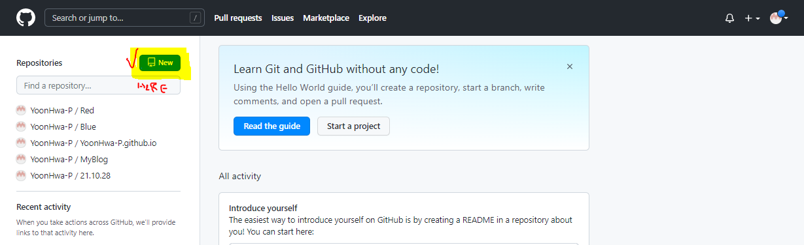
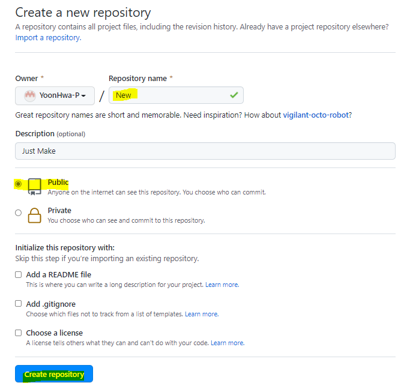
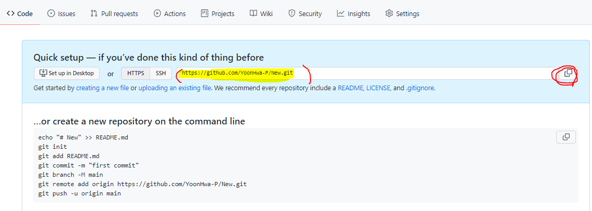

---
title: Method Making New Repository 
---
###### Hello World I'm in the Mars

<br><br>

---
## Github에서
###새로운 저장소 만들기 


1. git hub 로그인 후 새로운 저장소를 만들어 보도록 합시다.
  <br>



 new 를 누르면 새로운 repository를 생성하기 위한 정보를 입렬 할 수있다. 

<br>
<br>
<br>

2. Repository name 입력 후 Public(전체 공개)으로 할 것인지, Private(비공개)로 할 것인지 선택한다.



    <br>
    <br>
    마지막으로 create repository를 누르면 생성됨. 

<br>

3. 생성된 repository에 README.md file을 생성해 봅시다. 
4. git bash를 열어봅시다. (원하는 경로에서)
5. git bash 에서 github에서 만든 file을 내려받아 봅니다.
``` bash
$ git clone + 나의 경로
```



혹시 나의 경로를 어디서 찾는지 잘 모르는 나를 위해 남긴다. <br>
_git bash네... bush인줄알았는데..._

<br>
<br>
<br>


6. 원하는 경로에 file이 생긴 것을 볼 수 있다. 
   + 이제 README.md file 을 만들어 보자. 위의 My path image를 보면 아랫쪽에 코드가 나와있는 것을 볼 수 있다. 
7. New file을 파이참으로 열어준 후  아래 코드를 한줄씩 입력 하면 된다. (위 사진에 나와 있는 코드!! )
``` bash
echo "# New" >> README.md
git init
git add README.md
git commit -m "first commit"
git branch -M main
git remote add origin https://github.com/ 이 부분이 사람마다 다르니 웹페이지 보고 하기!
git push -u origin main
```


<br>
<br>
<br>

8. 이제 저장소와 Desktop file이 페어링 되었다. 
9. 앞으로는 file Update후 git 명령어로 올리면 된다. 
10. 예를 들자면, folder에 file을 넣고, pycham으로 foler를 열어서 다음과 같은 명령어를 넣으면 된다. 

```bash
git add . -- 모든 file을 업로드 하기 위해 저장
git commit -m "history Log로 확인 할수 있는 message" -- 확인
git push  -- 최종적으로 file을 git hub에 올림
```

<br>
<br>
<br>
 
이제 전세계 어디에 있던 대용량 파일 저장소를 직접 손에 들고 다닐 일이 없어진거다. (물론 인터넷이 잘 된다는 가정 하에서....)<br>
하지만, 나는 오늘도 노파심에 외장하드를 들고 나왔다 하하  <br>
앞으로 github에 다 정리해서 넣고  외장하드 안가지고 다녀야지 ^^ 화이팅 !!

