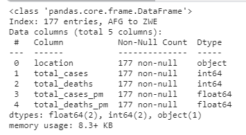
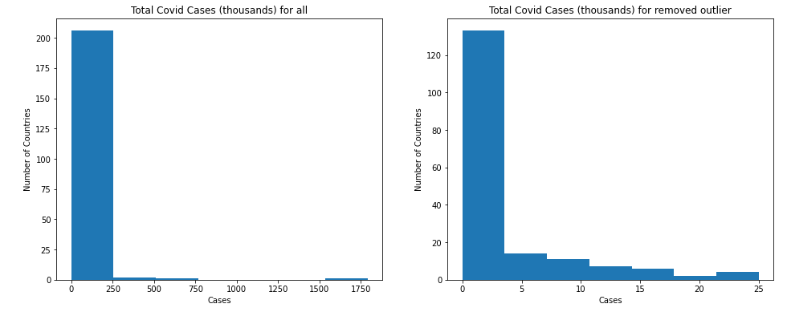

§ [결측치 찾기 이론](https://yoonhwa-p.github.io/2021/12/21/python/DTS_MissingValue)

§ [결측치 찾기 실습](https://yoonhwa-p.github.io/2021/12/21/python/DTS_MissingValue2)

§ [변수 1개를 이용하여 이상값 찾기 ](https://yoonhwa-p.github.io/2021/12/21/python/DTS_Outlier_detection)

§ [변수 2개를 이용하여 이상값 찾기 ]()

---

## 이상값 찾기 

- 주관적이며 연구자 마다 다르고, 산업에 따라 차이가 있다. 
- 통계에서의 이상값
  + 정규 분포를 이루고 있지 않음 : 이상값이 존재
  + 왜도, 첨도가 발생.
- 균등분포(Uniform distribution)


    1. 변수 1개를 이용하여 이상값 찾기 


```python
import numpy as np
import matplotlib.pyplot as plt
import pandas as pd
import statsmodels.api as sm # 검정 확인을 위한 그래프 
import scipy.stats as scistat #샤피로 검정을 위한 Library

covidtotals = pd.read_csv("../input/covid-data/covidtotals.csv")
covidtotals.set_index("iso_code", inplace = True)

case_vars = ["location", "total_cases", "total_deaths", "total_cases_pm", "total_deaths_pm"]
demo_vars = ["population", "pop_density", "median_age", "gdp_per_capita", "hosp_beds"]

covidtotals.head()
```
 <br><br>


- 결측치와 마찬가지로 covidtotals data를 kaggle note에 불러와서 실행 

<br><br><br>

### 백분위수(quantile)로 데이터 표시  

- 판다스 내부의 함수를 이용하여 확인한다. 

```python
covid_case_df = covidtotals.loc[:, case_vars]
covid_case_df.describe

covid_case_df.quantile(np.arange(0.0, 1.1, 0.1))
#Index이기 때문에 1.1로 표시 
```


<br><br>

### 왜도(대칭 정도), 첨도(뾰족한 정도) 구하기 

- 역시 pandas 함수를 이용.

<br> <div style="border: 2px wave salmon">
- 들어가기 전에


[pandas.DataFrame.skew](https://pandas.pydata.org/docs/reference/api/pandas.DataFrame.skew.html)

- 위와 같은 Warring Error가 발생 하면, 구글링을 통해 처리 할 수 있어야 한다. 


</div><br><br>

#### 왜도 구하기 

```python
covid_case_df.skew(axis=0, numeric_only = True)
```

> total_cases        10.804275  <br>
total_deaths        8.929816 <br>
total_cases_pm      4.396091 <br>
total_deaths_pm     4.674417 <br>
dtype: float64 <br>

- -1~1사이에 있어야 대칭이다.
- `skewness` < |3|  : 기본적 허용
- 대칭이 아닌 것을 알 수 있다. 
( <p style="color:#C6563B;font-size:110%;"> = 정규분포가 아니다.</p> )

<br><br>

---

#### 첨도 구하기 

- 정규 분포의 첨도는 0이다. 
  + 0보다 크면 더 뾰족하고 
  + 0보다 작으면 뭉툭하다.

```python
#첨도 구하기 
covid_case_df.kurtosis(axis=0, numeric_only = True)
```

>total_cases        134.979577 <br>
total_deaths        95.737841 <br> 
total_cases_pm      25.242790 <br>
total_deaths_pm     27.238232 <br>
dtype: float64 <br>

<br>

- 5~10 정도 사이에 첨도가 있어야 하는데 정규분포를 이루고 있지 않다. 
  + `kurtosis` < |7|  : 기본적 허용
- ( <p style="color:#C6563B;font-size:110%;"> = 정규분포가 아니다.</p> )
  +  이산값이 있을 확률이 높다는 것을 알 수 있다. 

<br><br>

### 정규성 검정 테스트 

1. 정규성 가정을 검토하는 방법
   1. Q-Q plot
      1. 그래프로 정규성 확인
         - 눈으로 보는 것이기 때문에 해석이 주관적.
   2. Shapiro-Wilk Test (샤피로-윌크 검정)
      - 귀무가설 : 표본의 모집단이 정규 분포를 이루고 있다. (H0: 정규분포를 따른다 `p-value` > 0.05)
      - 대립가설 : 표본의 모집단이 정규 분포를 이루고 있지 않다.
      - `p value` < 0.05 : 귀무가설을 충족하지 않아 대립가설로 
   3. Kolnogorov-Smirnov test (콜모고로프-스미노프 검정)
      1. EDF(Empirical distribution fuction)에 기반한 적합도 검정방법
        - 자료의 평균/표준편차, Histogram을 통해 표준 정규분포와 비교하여 적합도 검정.
        - `p value` > 0.05 : 정규성 가정

<br><br>


#### Shapiro-Wilk Test

```python
# 샤피로 검정
scistat.shapiro(covid_case_df['total_cases'])
```

>ShapiroResult(statistic=0.19379639625549316, pvalue=3.753789128593843e-29)

- 우리는 `p value` 를 가지고 유의성을 확인한다. 
-  `p value` : 3.75e-29 이므로 정규분포를 이루지 않음.

<br>

> covid_case_df['total_cases'] 안에 아래 column들을 하나씩 다 넣어 봐야 한다. 

```python
case_vars = ["location", "total_cases", "total_deaths", "total_cases_pm", "total_deaths_pm"]
demo_vars = ["population", "pop_density", "median_age", "gdp_per_capita", "hosp_beds"]
```

- 함수를 짜면 너의 code가 될 것이라고 한다. 

<br><br>


#### qqplot
- 통계적 이상값 범위 : 1사분위 (25%), 3사분위(75%) 사이의 거리 
  + 그 거리가 상하좌우 1.5배를 넘으면 이상값으로 여김

```python
sm.qqplot(covid_case_df[["total_cases"]].sort_values(
    ["total_cases"]), line = 's')
plt.title("Total Class")
```


<br><br>

```python
thirdq = covid_case_df["total_cases"].quantile(0.75)
firstq = covid_case_df["total_cases"].quantile(0.25)

interquantile_range = 1.5 * (thirdq- firstq)
outlier_high = interquantile_range + thirdq
outliner_low = firstq - interquantile_range

print(outliner_low, outlier_high, sep = " <-------> ")
```
> -14736.125 <-------> 25028.875

<br><br>

## 이상치를 제거한 data 가져오기 

1. 조건: outlier_high 보다 높은 이상치 or outlier_low 보다 낮은 이상치 

```python
remove_outlier_df = covid_case_df.loc[~(covid_case_df["total_cases"]>outlier_high)|(covid_case_df["total_cases"]<outliner_low)]
remove_outlier_df.info()
```



<br> <div style="border: 2px dotted salmon">
<br> 
- 이상치 data

```python
remove_outlier_df = covid_case_df.loc[(covid_case_df["total_cases"]>outlier_high)|(covid_case_df["total_cases"]<outliner_low)]
remove_outlier_df.info()
```


<br> 
</div>


```python
fig, ax = plt.subplots(figsize = (16, 6), ncols = 2)
ax[0].hist(covid_case_df["total_cases"]/1000, bins = 7)
ax[0].set_title("Total Covid Cases (thousands) for all")
ax[0].set_xlabel("Cases")
ax[0].set_ylabel("Number of Countries")
ax[1].hist(remove_outlier_df["total_cases"]/1000, bins = 7)
ax[1].set_title("Total Covid Cases (thousands) for removed outlier")
ax[1].set_xlabel("Cases")
ax[1].set_ylabel("Number of Countries")
plt.show()
```



- 완벽하진 않지만, 먼 잔차들을 제거한 정규 분포를 이루는 듯한 그래프를 얻을 수 있었다. 
- 이를 train data에 EDA로 돌리고, ML을 진행 하면 더 좋은 score를 얻을 수도 있고, 아닐 수도 있다. 
- just Test 