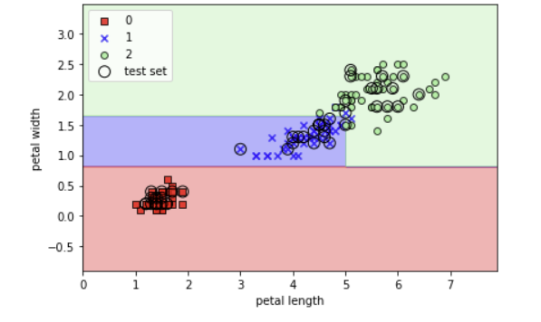

## machine Learning Model Algoridms

- 비 선형 모델  : KNN, 
- 선형 모델 : 

<br><br>

---

Decision Tree MachineLearning


### Introduction 

 - 과적합 : 모델의 정확도만 높이기 위해 분류 조건(depth)만 강조하여 실제 상황에서 유연하게 대처하는 능력이 떨어지게 되는 문제가 발생하게 되는것.
 - 가지치기(pruning)을 통해 유연성을 유지. 
   - Max_depth를 대략적으로 잡아서 (3, 5, 10...) RMS 값 비교
   - Random search
   - 하이퍼파라미터 (grid Search)
 
<br><br>

 - 분류기준 (수식은 아래서 책에서 확인)
   1. 정보이득 : 
      - 자식노드의 불순도가 낮을 수록 정보의 이득이 커진다.(효율성 Up)
      - 정보 이득이 높은 속성을 기준으로 알아서 나누어 준다. 
      1. 엔트로피의 정의 :
         - 엔트로피는 높을 수록 좋다.  
      2. 지니불순도 :
         - 순도는 높을 수록 좋다. 
      3. 분류오차 :
         - 어떤 시나리오가 더 좋은가에 대한 계산
         - 1이 되면 균등, 완벽하게 나누어 졌다고 

 - ㅇㅇ


공식은 이쪽에 가면 있다. 

---

계산은 컴퓨터가 다 해준다. 

우리는 보고 좋은 분류 기준을 선택 하며 됩니다. 

#### 분류기준 1. 분류 오차 


#### 분류기준 2. 지니 불순도 


#### 분류기준 2. 엔트로피


---

- 정보이득을 최대로 하는 옵션을 찾는다. 

<br><br><br>


---

### 실습 


```python
from sklearn import datasets 
import numpy as np 

iris = datasets.load_iris()
X = iris.data[:, [2, 3]]
y = iris.target 

print("클래스 레이블:", np.unique(y))
```

>클래스 레이블: [0 1 2]


```python
from sklearn.model_selection import train_test_split

X_train, X_test, y_train, y_test = train_test_split(
    X, y, test_size = 0.3, random_state = 1
)

print("y 레이블 갯수:", np.bincount(y))
```

>y 레이블 갯수: [50 50 50]

<br><br>


#### 시각화

```python
from matplotlib.colors import ListedColormap
import matplotlib.pyplot as plt

def plot_decision_regions(X, y, classifier, test_idx=None, resolution=0.02):

    # 마커와 컬러맵을 설정합니다.
    markers = ('s', 'x', 'o', '^', 'v')
    colors = ('red', 'blue', 'lightgreen', 'gray', 'cyan')
    cmap = ListedColormap(colors[:len(np.unique(y))])

    # 결정 경계를 그립니다.
    x1_min, x1_max = X[:, 0].min() - 1, X[:, 0].max() + 1
    x2_min, x2_max = X[:, 1].min() - 1, X[:, 1].max() + 1
    xx1, xx2 = np.meshgrid(np.arange(x1_min, x1_max, resolution),
                           np.arange(x2_min, x2_max, resolution))
    Z = classifier.predict(np.array([xx1.ravel(), xx2.ravel()]).T)
    Z = Z.reshape(xx1.shape)
    plt.contourf(xx1, xx2, Z, alpha=0.3, cmap=cmap)
    plt.xlim(xx1.min(), xx1.max())
    plt.ylim(xx2.min(), xx2.max())

    for idx, cl in enumerate(np.unique(y)):
        plt.scatter(x=X[y == cl, 0], 
                    y=X[y == cl, 1],
                    alpha=0.8, 
                    c=colors[idx],
                    marker=markers[idx], 
                    label=cl, 
                    edgecolor='black')

    # 테스트 샘플을 부각하여 그립니다.
    if test_idx:
        X_test, y_test = X[test_idx, :], y[test_idx]

        plt.scatter(X_test[:, 0],
                    X_test[:, 1],
                    c='',
                    edgecolor='black',
                    alpha=1.0,
                    linewidth=1,
                    marker='o',
                    s=100, 
                    label='test set')
```

```python
import matplotlib.pyplot as plt
import numpy as np

# 지니 불순도 함수
def gini(p):
    return p * (1 - p) + (1 - p) * (1 - (1 - p))


# 엔트로피 함수 
def entropy(p):
    return - p * np.log2(p) - (1 - p) * np.log2((1 - p))

# 분류 오차
def error(p):
    return 1 - np.max([p, 1 - p])

x = np.arange(0.0, 1.0, 0.01)

ent = [entropy(p) if p != 0 else None for p in x]
sc_ent = [e * 0.5 if e else None for e in ent]
err = [error(i) for i in x]

fig = plt.figure()
ax = plt.subplot(111)
for i, lab, ls, c, in zip([ent, sc_ent, gini(x), err], 
                          ['Entropy', 'Entropy (scaled)', 
                           'Gini Impurity', 'Misclassification Error'],
                          ['-', '-', '--', '-.'],
                          ['black', 'lightgray', 'red', 'green', 'cyan']):
    line = ax.plot(x, i, label=lab, linestyle=ls, lw=2, color=c)

ax.legend(loc='upper center', bbox_to_anchor=(0.5, 1.15),
          ncol=5, fancybox=True, shadow=False)

ax.axhline(y=0.5, linewidth=1, color='k', linestyle='--')
ax.axhline(y=1.0, linewidth=1, color='k', linestyle='--')
plt.ylim([0, 1.1])
plt.xlabel('p(i=1)')
plt.ylabel('Impurity Index')
plt.show()
```


---

- 정보 이득을 최대로 하는 옵션을 찾아서 

```python
from sklearn.tree import DecisionTreeClassifier

tree_gini = DecisionTreeClassifier(criterion="gini", max_depth=3)
tree_gini.fit(X_train, y_train)
```

>DecisionTreeClassifier(max_depth=3)
> 


```python
X_combined = np.vstack((X_train, X_test))
y_combined = np.hstack((y_train, y_test))

plot_decision_regions(X_combined, y_combined, classifier=tree_gini, test_idx = range(105, 150))
plt.xlabel("petal length")
plt.ylabel("petal width")
plt.legend(loc = "upper left")
plt.tight_layout()
plt.show()
```




- gini 로 1개 Entripy 로 1개 짜서 해야함 
+ `gini`: default 
+ `Entropy` : 도 해보고 비교

```python
tree_Entropy.fit(x_train, y_train)

x_combined = np.vstack((x_train, x_test))
y_combined = np.hstack((y_trin, y_test))

plot_decision_regions(x_combined, y_combined, 
                      classifier= tree_Entropy, test_idx = range(105, 150) )

plt.legend(loc= "upper left")
plt.tight_layout()
plt.show
```

- 모형을 도식화로 

```python
from pydotplus import graph_from_dot_data
from sklearn.tree import export_graphviz

dot_data = export_graphviz(tree_entropy,
                           filled=True, 
                           rounded=True,
                           class_names=['Setosa', 
                                        'Versicolor',
                                        'Virginica'],
                           feature_names=['petal length', 
                                          'petal width'],
                           out_file=None) 
graph = graph_from_dot_data(dot_data) 
graph.write_png('gini_tree.png') 
```


entropy가 0이 되면 더이상 나눌 필요가 없다. 

+ sklearn에서는 분류오차는 없다. 


- 지니 와 엔트로피 두개를 보고 더 나은 것을 선택 


[머신러닝 배우기](https://asummerz.tistory.com/16)


<아직 안배운 부분>
+ 스태킹 알고리즘 (앙상블)
+ 