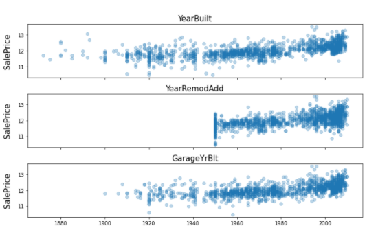
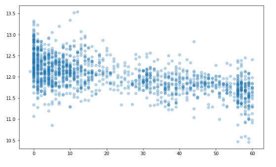
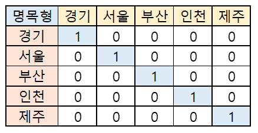
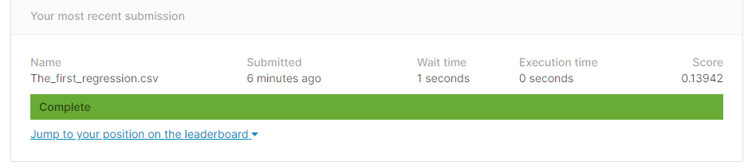

## Kaggle 주택가격 예측

[Kaggle house oruces advabced regression](https://www.kaggle.com/c/house-prices-advanced-regression-techniques/)


<br><br>


---

```python
# This Python 3 environment comes with many helpful analytics libraries installed
# It is defined by the kaggle/python Docker image: https://github.com/kaggle/docker-python
# For example, here's several helpful packages to load

import numpy as np # linear algebra
import pandas as pd # data processing, CSV file I/O (e.g. pd.read_csv)

# Input data files are available in the read-only "../input/" directory
# For example, running this (by clicking run or pressing Shift+Enter) will list all files under the input directory

import os
for dirname, _, filenames in os.walk('/kaggle/input'):
    for filename in filenames:
        print(os.path.join(dirname, filename))

# You can write up to 20GB to the current directory (/kaggle/working/) that gets preserved as output when you create a version using "Save & Run All" 
# You can also write temporary files to /kaggle/temp/, but they won't be saved outside of the current session
```

## 데이터 다운로드 및 불러오기


```python
import pandas as pd

train = pd.read_csv("/kaggle/input/house-prices-advanced-regression-techniques/train.csv")
test = pd.read_csv("/kaggle/input/house-prices-advanced-regression-techniques/test.csv")

train.shape, test.shape
#변수를 줄여야 겠다. 어떤 변수를 줄여야 할까 ?
```

## EDA
 - 이상치과 중복값 제거
 - overallQual (주택의 상태를 1~10등급으로 책정)
 - 평점 1 : 판매가가 높음 = 이상치라고 판단 할 수 있따. : 이걸 제거 해 줘야 함.
 


```python
train.info()
#80개 컬럼, SalePrice(독립변수)를 제거 하고는 나머지가 종속변수 = 너무 많다 !! 
```


```python
train.drop(train[(train['OverallQual'] < 5) & (train['SalePrice']> 200000)].index, inplace = True)
train.reset_index(drop = True, inplace = True)
train.shape
```

## 종속변수 시각화


```python
import seaborn as sns
import matplotlib.pyplot as plt
from scipy.stats import norm

(mu, sigma) = norm.fit(train['SalePrice'])
print("The value of mu before log transformation is:", mu)
print("The value of sigma before log transformation is:", sigma)

fig, ax = plt.subplots(figsize=(10, 6))
sns.histplot(train['SalePrice'], color="b", stat="probability")
ax.xaxis.grid(False)
ax.set(ylabel="Frequency")
ax.set(xlabel="SalePrice")
ax.set(title="SalePrice distribution")

plt.axvline(mu, color='r', linestyle='--')
plt.text(mu + 10000, 0.11, 'Mean of SalePrice', rotation=0, color='r')
fig.show()
```


```python
import numpy as np 

train["SalePrice"] = np.log1p(train["SalePrice"]) # 로그 변환 후 종속 변수 시각화 

(mu, sigma) = norm.fit(train['SalePrice'])
print("The value of mu before log transformation is:", mu)
print("The value of sigma before log transformation is:", sigma)

fig, ax = plt.subplots(figsize=(10, 6))
sns.histplot(train['SalePrice'], color="b", stat="probability")
ax.xaxis.grid(False)
ax.set(ylabel="Frequency")
ax.set(xlabel="SalePrice")
ax.set(title="SalePrice distribution")

plt.axvline(mu, color='r', linestyle='--')
plt.text(mu + 0.05, 0.111, 'Mean of SalePrice', rotation=0, color='r')
plt.ylim(0, 0.12)
fig.show()
```

## data feature 제거
1. 모형 학습 시간 감소 
2. 연산 시 noise 감소


그래서 : train ID 를 빼주기로함 


```python
train_ID = train['Id']
test_ID = test['Id']
train.drop(['Id'], axis=1, inplace=True)
test.drop(['Id'], axis=1, inplace=True)
train.shape, test.shape
```


```python
# y 값 추출, dataset 분리할때 사용
y = train['SalePrice'].reset_index(drop=True)

# 뽑고 나면 원래 df에서 제거
train = train.drop('SalePrice', axis = 1)
train.shape, test.shape, y.shape


```


```python
# data 합치기 
# - train data 와  Test를 같이 전처리 하기 위해 

all_df = pd.concat([train, test]).reset_index(drop=True)
all_df.shape
```

## 결측치 확인 
- 결측치 처리 
    1. 제거하기 : column 제거, 특정 행만 제거하기 
    2. 채우기 : 1) numeric(수치형) : 평균 또는 중간값으로  채우기 
               2) String(문자형) : 최빈값으로 채우기 
    3. 통계 기법이용, 채우기 **(data 보간)**
        - 실무에서는 (KNNImput)등, 시계열 자료 or 산업군에 따라 다르므로 가서 배워라.
        - 


```python
#결측치 확인 

def check_na(data, head_num = 6):
  isnull_na = (data.isnull().sum() / len(data)) * 100
  data_na = isnull_na.drop(isnull_na[isnull_na == 0].index).sort_values(ascending=False)
  missing_data = pd.DataFrame({'Missing Ratio' :data_na, 
                               'Data Type': data.dtypes[data_na.index]})
  print("결측치 데이터 컬럼과 건수:\n", missing_data.head(head_num))

check_na(all_df, 20)
```


```python
all_df.drop(['PoolQC', 'MiscFeature', 'Alley', 'Fence', 'FireplaceQu', 'LotFrontage'], axis=1, inplace=True)
check_na(all_df)

#아직도 결측치가 많이 있다. 
```

## 채우기 

    1. 문자열 채우기 
    2. 
    
1. object column 추출 


```python
#a = all_df['BsmtCond'].value_counts().mode() #mode() : 최빈값 가장 빈도수가 높은 값 찾기
#a

print(all_df['BsmtCond'].value_counts())
print()
print(all_df['BsmtCond'].mode()[0])

#object column, 갯수 확인
import numpy as np
cat_all_vars = train.select_dtypes(exclude=[np.number]) #숫자인 것을 제외한 type column 이름 추출
print("The whole number of all_vars(문자형data)", len(list(cat_all_vars)))

#column 이름 뽑아내기 
final_cat_vars = []
for v in cat_all_vars:
    if v not in ['PoolQC', 'MiscFeature', 'Alley', 'Fence', 'FireplaceQu', 'LotFrontage']:
        final_cat_vars.append(v)

print("The whole number of final_cat_vars", len(final_cat_vars))

#최빈값을 찾아 넣어주기
for i in final_cat_vars:
  all_df[i] = all_df[i].fillna(all_df[i].mode()[0])

check_na(all_df, 20)
print("숫자형 data set의 결측치만 남은 것을 알 수 있다. ")
```


```python
import numpy as np
num_all_vars = list(train.select_dtypes(include=[np.number]))
print("The whole number of all_vars", len(num_all_vars))

num_all_vars.remove('LotFrontage')

print("The whole number of final_cat_vars", len(num_all_vars))
for i in num_all_vars:
  all_df[i].fillna(value=all_df[i].median(), inplace=True)

print("결측치가 존재 하지 않은 것을 알 수 있다. ")
check_na(all_df, 20)
```


```python
all_df.info()
```

### 왜도(Skewnewss) 처리하기 : 정규 분포를 이룰 수 있게 (설문조사 논문 통계의 경우 -1< 외도 <1)

- boxcose를 사용 할 예정
- 왜도가 양수일때, 음수일때 (좌, 우로 치우친 정도)
- 첨도가 양수일때, 음수일때 (뽀족한 정도)

- RMSE를 최적(낮게)으로 만들기 위해 조정.


```python
from scipy.stats import skew

#외도 판정을 받을 만한 data set을 확인 
def find_skew(x):
  return skew(x)
#앞에서 뽑은 numeric columns : num_all_vars
#사용자 정의함수를 쓰기 위해 apply(find_skew)를 사용, 오름차순정렬

skewness_features = all_df[num_all_vars].apply(find_skew).sort_values(ascending=False)
skewness_features

#high_skew = skew_valrs[slew_var > 1]

#0~1사이에 있는 것이 기준. 기준 밖으로 나간 경우 조정이 필요(정규분포를 만들어 주기 위해)
# 1. 박스코스 변환 : ML -> RMSE (2.5) 
# 2. 로그변환     : ML -> RMSE (2.1)
# => RMSE는 적은 것이 좋기 때문에, 로그 변환으로 사용 하는 것이 좋다. 
```


```python
skewnewss_index = list(skewness_features.index)
skewnewss_index.remove('LotArea')
#외도 정도가 너무 높은 LotArea를 날려주는 것.
all_numeric_df = all_df.loc[:, skewnewss_index]


fig, ax = plt.subplots(figsize=(10, 6))
ax.set_xlim(0, all_numeric_df.max().sort_values(ascending=False)[0])
ax = sns.boxplot(data=all_numeric_df[skewnewss_index] , orient="h", palette="Set1")
ax.xaxis.grid(False)
ax.set(ylabel="Feature names")
ax.set(xlabel="Numeric values")
ax.set(title="Numeric Distribution of Features Before Box-Cox Transformation")
sns.despine(trim=True, left=True)
```


```python
from scipy.special import boxcox1p
from scipy.stats import boxcox_normmax

high_skew = skewness_features[skewness_features > 1]
high_skew_index = high_skew.index

print("The data before Box-Cox Transformation: \n", all_df[high_skew_index].head())

for num_var in high_skew_index:
  all_df[num_var] = boxcox1p(all_df[num_var], boxcox_normmax(all_df[num_var] + 1))

print("The data after Box-Cox Transformation: \n", all_df[high_skew_index].head())
```


```python
fig, ax = plt.subplots(figsize=(10, 6))
ax.set_xscale('log')
ax = sns.boxplot(data=all_df[high_skew_index] , orient="h", palette="Set1")
ax.xaxis.grid(False)
ax.set(ylabel="Feature names")
ax.set(xlabel="Numeric values")
ax.set(title="Numeric Distribution of Features Before Box-Cox Transformation")
sns.despine(trim=True, left=True)
```

### 도출 변수

Feature Engineering 의 Key step
- 판매량, 단가, *매출액 X*
- 판매량 X 단가 = 매출액(New Value) : 도출 변수
    + ML은 수식이기 때문에 도출변수가 생성 되는것은 연산의 증가로 이어진다. 
    + 시간이 오래 걸린다.
    + 결론 : 변수를 줄이는 것이 좋다. 
    


```python
#집의 층수 를 더해서 전체면적이라는 변수를 도출 
all_df['TotalSF'] = all_df['TotalBsmtSF'] + all_df['1stFlrSF'] + all_df['2ndFlrSF']
all_df = all_df.drop(['TotalBsmtSF', '1stFlrSF', '2ndFlrSF'], axis=1)
print(all_df.shape)
```


```python
all_df['Total_Bathrooms'] = (all_df['FullBath'] + (0.5 * all_df['HalfBath']) + all_df['BsmtFullBath'] + (0.5 * all_df['BsmtHalfBath']))
all_df['Total_porch_sf'] = (all_df['OpenPorchSF'] + all_df['3SsnPorch'] + all_df['EnclosedPorch'] + all_df['ScreenPorch'])
all_df = all_df.drop(['FullBath', 'HalfBath', 'BsmtFullBath', 'BsmtHalfBath', 'OpenPorchSF', '3SsnPorch', 'EnclosedPorch', 'ScreenPorch'], axis=1)
print(all_df.shape)
```

- 따라서 data 정의서 먼저 봐야 한다. : data description.txt를 먼저 봐야 한다. !!! (실무에서는 없는 경우가 많다.) 
- 시각화 : 각각의 data 무한작업, 도메인 공부 
- 


```python
# 연도와 관련된.
num_all_vars = list(train.select_dtypes(include=[np.number]))
year_feature = []
for var in num_all_vars:
  if 'Yr' in var:
    year_feature.append(var)
  elif 'Year' in var:
    year_feature.append(var)
  else:  
    print(var, "is not related with Year")
print(year_feature)
```


```python
fig, ax = plt.subplots(3, 1, figsize=(10, 6), sharex=True, sharey=True)
for i, var in enumerate(year_feature):
  if var != 'YrSold':
    ax[i].scatter(train[var], y, alpha=0.3)
    ax[i].set_title('{}'.format(var), size=15)
    ax[i].set_ylabel('SalePrice', size=15, labelpad=12.5)
plt.tight_layout()
plt.show()
```




<br><br>

```python
all_df = all_df.drop(['YearBuilt', 'GarageYrBlt'], axis=1)
print(all_df.shape)
```


```python
# 리모델링 시점으로 부터 얼마나 되었나 + 팔리는거
YearsSinceRemodel = train['YrSold'].astype(int) - train['YearRemodAdd'].astype(int)

fig, ax = plt.subplots(figsize=(10, 6))
ax.scatter(YearsSinceRemodel, y, alpha=0.3)
fig.show()
```



<br><br>

```python
all_df['YearsSinceRemodel'] = all_df['YrSold'].astype(int) - all_df['YearRemodAdd'].astype(int)
all_df = all_df.drop(['YrSold', 'YearRemodAdd'], axis=1)
print(all_df.shape)
```

## 더미변수 

### String data (non-Numeric) 

-  명목형      : 남학생, 여학생...  
-  서열형(순서) : 1등급, 2등급, 3등급 (가중치, 등급숫자 등으로 바꿀 수 있다. )



<br><br>


- 세부적으로 customize 하는 것이 낫다. 
- 명목형 series에 따라 17개의  model을 개별적으로  만들되, 하나의 모델처럼 보이게 시각화 대시보드로 만들어 줘야 합니다. 


```python
all_df['PoolArea'].value_counts()
#0과 다른값들.. 으로 되어있어서 
```


```python
# 0과 1로 나누어 적용
def count_dummy(x):
  if x > 0:
    return 1
  else:
    return 0
```


```python
all_df['PoolArea'] = all_df['PoolArea'].apply(count_dummy)
all_df['PoolArea'].value_counts()

# 전체 경향 등에 거의 영향을 주지 않음 
```


```python
all_df['GarageArea'] = all_df['GarageArea'].apply(count_dummy)
all_df['GarageArea'].value_counts()
```


```python
all_df['Fireplaces'] = all_df['Fireplaces'].apply(count_dummy)
all_df['Fireplaces'].value_counts()
```

<br><br>

### Label Encoding, Ordinal Encoding, One-Hot Encoding

---

- Label Encoding : 종속변수에만 
- Ordinal Encoding : 독립변수에만
- 써야 하지만, 개념은 같다. 
- One-Hot Encoding :


```python
from sklearn.preprocessing import LabelEncoder
import pandas as pd

temp = pd.DataFrame({'Food_Name': ['Apple', 'Chicken', 'Broccoli'], 
                     'Calories': [95, 231, 50]})

encoder = LabelEncoder()
encoder.fit(temp['Food_Name'])
labels = encoder.transform(temp['Food_Name'])
print(list(temp['Food_Name']), "==>", labels)
```


```python
from sklearn.preprocessing import OrdinalEncoder
import pandas as pd

temp = pd.DataFrame({'Food_Name': ['Apple', 'Chicken', 'Broccoli'], 
                     'Calories': [95, 231, 50]})

encoder = OrdinalEncoder()
labels = encoder.fit_transform(temp[['Food_Name']])
print(list(temp['Food_Name']), "==>", labels.tolist())


```


```python
# import pandas as pd
# temp = pd.DataFrame({'Food_Name': ['Apple', 'Chicken', 'Broccoli'], 
#                      'Calories': [95, 231, 50]})

# temp[['Food_No']] = temp.Food_Name.replace(['Chicken', 'Broccoli', 'Apple'],[1, 2, 3])

# print(temp[['Food_Name', 'Food_No']])

#ValueError: Columns must be same length as key

```


```python
import pandas as pd

temp = pd.DataFrame({'Food_Name': ['Apple', 'Chicken', 'Broccoli'], 
                     'Calories': [95, 231, 50]})

temp = pd.get_dummies(temp)
print(temp)
print(temp.shape)
```


```python
all_df = pd.get_dummies(all_df).reset_index(drop=True)
all_df.shape
```

## 머신러닝 모형 학습 및 평가

#### 데이터셋 분리 및 교차 검증

---

```python
X = all_df.iloc[:len(y), :]
X_test = all_df.iloc[len(y):, :]
X.shape, y.shape, X_test.shape
```


```python
from sklearn.model_selection import train_test_split
X_train, X_test, y_train, y_test = train_test_split(X, y, test_size = 0.25, random_state = 0)
X_train.shape, X_test.shape, y_train.shape, y_test.shape
```

<br><br>

### 평가지표
#### MAE

---

```python
import numpy as np

def mean_absolute_error(y_true, y_pred):

  error = 0
  for yt, yp in zip(y_true, y_pred):
    error = error + np.abs(yt-yp)
  
  mae = error / len(y_true)
  return mae
```


```python
import numpy as np

def mean_squared_error(y_true, y_pred):

  error = 0
  for yt, yp in zip(y_true, y_pred):
    error = error + (yt - yp) ** 2
  
  mse = error / len(y_true)
  return mse
```

<br><br>

#### RMSE

---

```python
import numpy as np

def root_rmse_squared_error(y_true, ypred):
  error = 0
  
  for yt, yp in zip(y_true, y_pred):
    error = error + (yt - yp) ** 2
  
  mse = error / len(y_true)
  rmse = np.round(np.sqrt(mse), 3)
  return rmse
```

#### Test1


```python
y_true = [400, 300, 800]
y_pred = [380, 320, 777]

print("MAE:", mean_absolute_error(y_true, y_pred))
print("MSE:", mean_squared_error(y_true, y_pred))
print("RMSE:", root_rmse_squared_error(y_true, y_pred))
```

#### Test2


```python
y_true = [400, 300, 800, 900]
y_pred = [380, 320, 777, 600]

print("MAE:", mean_absolute_error(y_true, y_pred))
print("MSE:", mean_squared_error(y_true, y_pred))
print("RMSE:", root_rmse_squared_error(y_true, y_pred))
```

<br><br>

#### RMSE with Sklean

---

```python
from sklearn.metrics import mean_squared_error

def rmsle(y_true, y_pred):
    return np.sqrt(mean_squared_error(y_true, y_pred))
```

<br><br>

### 모형 정의 및 검증 평가

---

```python
from sklearn.metrics import mean_squared_error
from sklearn.model_selection import KFold, cross_val_score
from sklearn.linear_model import LinearRegression

def cv_rmse(model, n_folds=5):
    cv = KFold(n_splits=n_folds, random_state=42, shuffle=True)
    rmse_list = np.sqrt(-cross_val_score(model, X, y, scoring='neg_mean_squared_error', cv=cv))
    print('CV RMSE value list:', np.round(rmse_list, 4))
    print('CV RMSE mean value:', np.round(np.mean(rmse_list), 4))
    return (rmse_list)

n_folds = 5
rmse_scores = {}
lr_model = LinearRegression()
```


```python
score = cv_rmse(lr_model, n_folds)
print("linear regression - mean: {:.4f} (std: {:.4f})".format(score.mean(), score.std()))
rmse_scores['linear regression'] = (score.mean(), score.std())
```

### 첫번째 최종 예측 값 제출


```python
from sklearn.model_selection import cross_val_predict

X = all_df.iloc[:len(y), :]
X_test = all_df.iloc[len(y):, :]
X.shape, y.shape, X_test.shape

lr_model_fit = lr_model.fit(X, y)
final_preds = np.floor(np.expm1(lr_model_fit.predict(X_test)))
print(final_preds)
```


```python
submission = pd.read_csv("sample_submission.csv")
submission.iloc[:,1] = final_preds
print(submission.head())
submission.to_csv("The_first_regression.csv", index=False)
```

### 모형 알고리즘 추가


```python
from sklearn.ensemble import RandomForestRegressor, GradientBoostingRegressor
from sklearn.tree import DecisionTreeRegressor
from sklearn.linear_model import LinearRegression

# LinearRegresison
lr_model = LinearRegression()

# Tree Decision 
tree_model = DecisionTreeRegressor()

# Random Forest Regressor
rf_model = RandomForestRegressor()

# Gradient Boosting Regressor
gbr_model = GradientBoostingRegressor()
```


```python
score = cv_rmse(lr_model, n_folds)
print("linear regression - mean: {:.4f} (std: {:.4f})".format(score.mean(), score.std()))
rmse_scores['linear regression'] = (score.mean(), score.std())
```


```python
score = cv_rmse(tree_model, n_folds)
print("Decision Tree Regressor - mean: {:.4f} (std: {:.4f})".format(score.mean(), score.std()))
rmse_scores['Decision Tree Regressor'] = (score.mean(), score.std())
```


```python
score = cv_rmse(rf_model, n_folds)
print("RandomForest Regressor - mean: {:.4f} (std: {:.4f})".format(score.mean(), score.std()))
rmse_scores['RandomForest Regressor'] = (score.mean(), score.std())
```


```python
score = cv_rmse(gbr_model, n_folds)
print("Gradient Boosting Regressor - mean: {:.4f} (std: {:.4f})".format(score.mean(), score.std()))
rmse_scores['Gradient Boosting Regressor'] = (score.mean(), score.std())
```


```python
fig, ax = plt.subplots(figsize=(10, 6))

ax = sns.pointplot(x=list(rmse_scores.keys()), y=[score for score, _ in rmse_scores.values()], markers=['o'], linestyles=['-'], ax=ax)
for i, score in enumerate(rmse_scores.values()):
    ax.text(i, score[0] + 0.002, '{:.6f}'.format(score[0]), horizontalalignment='left', size='large', color='black', weight='semibold')

ax.set_ylabel('Score (RMSE)', size=20, labelpad=12.5)
ax.set_xlabel('Model', size=20, labelpad=12.5)
ax.tick_params(axis='x', labelsize=13.5, rotation=10)
ax.tick_params(axis='y', labelsize=12.5)
ax.set_ylim(0, 0.25)
ax.set_title('Rmse Scores of Models without Blended_Predictions', size=20)

fig.show()
```

- RMSE 가 적은 것이 좋다. : 예측이 잘 된 Model이라고 할 수 있다. 


```python
lr_model_fit = lr_model.fit(X, y)
tree_model_fit = tree_model.fit(X, y)
rf_model_fit = rf_model.fit(X, y)
gbr_model_fit = gbr_model.fit(X, y)

def blended_learning_predictions(X): 
  blended_score = (0.3 * lr_model_fit.predict(X)) + \
  (0.1 * tree_model_fit.predict(X)) + \
  (0.3 * gbr_model_fit.predict(X)) + \
  (0.3* rf_model_fit.predict(X))
  return blended_score
```


```python
blended_score = rmsle(y, blended_learning_predictions(X))
rmse_scores['blended'] = (blended_score, 0)
print('RMSLE score on train data:')
print(blended_score)
```


```python
fig, ax = plt.subplots(figsize=(10, 6))

ax = sns.pointplot(x=list(rmse_scores.keys()), y=[score for score, _ in rmse_scores.values()], markers=['o'], linestyles=['-'], ax=ax)
for i, score in enumerate(rmse_scores.values()):
    ax.text(i, score[0] + 0.002, '{:.6f}'.format(score[0]), horizontalalignment='left', size='large', color='black', weight='semibold')

ax.set_ylabel('Score (RMSE)', size=20, labelpad=12.5)
ax.set_xlabel('Model', size=20, labelpad=12.5)
ax.tick_params(axis='x', labelsize=13.5, rotation=10)
ax.tick_params(axis='y', labelsize=12.5)
ax.set_ylim(0, 0.25)

ax.set_title('Rmse Scores of Models with Blended_Predictions', size=20)

fig.show()
```


```python
submission.iloc[:,1] = np.floor(np.expm1(blended_learning_predictions(X_test)))
submission.to_csv("The_second_regression.csv", index=False)
```


